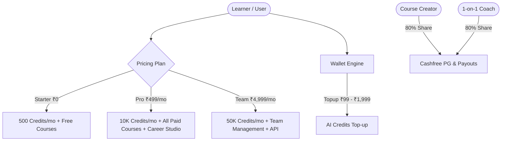

# Learnify AI — Platform Expansion & Architectural Master Plan

## Executive Overview
This phase executes a major expansion of **Learnify AI** by introducing 12 launch course categories with a deep 100+ topic curriculum catalog, 4 new Career Studio engines (*LinkedIn Optimizer*, *Career Analytics*, *Internship Tracker*, *Skill Gap Analysis*), an interactive **Watch Demo** modal, a complete **Documentation Hub** (`/docs`), **Creators & Coaches (Free vs Paid)** tier separation, **Mobile App Coming Soon** (Android & iOS) showcase, **Certificate Governance & Accreditation Advisory**, and homepage layout fixes.

---

## Technical Architecture & Proposed Changes

### 1. Instant UI & Layout Fixes
- **Homepage Section Reordering** ([index.tsx](file:///c:/Users/vishw/Music/Learnify%20AI/src/routes/index.tsx)):
  - Place **"How We Compare"** section *BEFORE* **"Why Learners Upgrade"**.
- **Responsive Profile Cover** ([settings.view.tsx](file:///c:/Users/vishw/Music/Learnify%20AI/src/views/settings.view.tsx), [u.$id.tsx](file:///c:/Users/vishw/Music/Learnify%20AI/src/routes/_authenticated/u.$id.tsx)):
  - Ensure missing profile cover defaults to a responsive SVG geometric gradient pattern on laptop screens.

### 2. Comprehensive Course Catalog & 12 Launch Categories
- **Files**: [courses.tsx](file:///c:/Users/vishw/Music/Learnify%20AI/src/routes/courses.tsx), [course-catalog.ts](file:///c:/Users/vishw/Music/Learnify%20AI/src/lib/course-catalog.ts)
- **12 Launch Categories**:
  1. Full Stack Development
  2. Python
  3. AI & Prompt Engineering
  4. Data Science
  5. Cyber Security
  6. UI/UX Design
  7. Resume Builder
  8. Interview Preparation
  9. Career Roadmaps
  10. Digital Marketing
  11. Freelancing
  12. Personal Branding
- **Expanded Subject Domains**: Tech, Design, Career, Business, Digital Marketing, Content Creation, AI Creator, Freelancing, Office & Productivity, Personal Development, Finance, Languages, Health & Wellness, Academic (BCA, BTech CSE, MCA, DSA, DBMS, OS, Computer Networks).
- **Difficulty Filters**: Beginner, Intermediate, Advanced.
- **"Coming Soon" Badges & Requests**: Visual indicators for upcoming courses and user course requests.

### 3. Career Studio — 4 New Features
- **File**: [career-studio.tsx](file:///c:/Users/vishw/Music/Learnify%20AI/src/routes/_authenticated/career-studio.tsx)
- **LinkedIn / GitHub Optimizer**: Headline generator, bio audit, keyword density checker, and engagement score.
- **Career Analytics**: Salary benchmarks, demand trends, and placement probability score.
- **Internship Tracker**: Application pipeline manager (Wishlist, Applied, Interviewing, Offer, Rejected).
- **Skill Gap Analysis**: Role-based target skill matrix with automated learning path recommendations.

### 4. Interactive Watch Demo Component
- **Files**: [WatchDemoModal.tsx](file:///c:/Users/vishw/Music/Learnify%20AI/src/components/interactive/WatchDemoModal.tsx), [index.tsx](file:///c:/Users/vishw/Music/Learnify%20AI/src/routes/index.tsx), [AppShell.tsx](file:///c:/Users/vishw/Music/Learnify%20AI/src/components/AppShell.tsx)
- Interactive walkthrough covering:
  1. **What is Learnify AI?** (AI Tutor, Resume Builder, Mock Interviews).
  2. **How to Use It?** (Course enrollment, AI credits, custom certificates).
  3. **How to Earn?** (Creator 80/20 revenue share, Coach paid sessions, Affiliate referrals).

### 5. Documentation Hub (`/docs`)
- **File**: [NEW] [docs.tsx](file:///c:/Users/vishw/Music/Learnify%20AI/src/routes/docs.tsx)
- Complete structured guide for:
  - **Students**: Getting started, AI credits usage, earning certificates, redeeming coupons.
  - **Creators (Free vs Paid)**: Course publishing, pricing strategies, 80% payout rules.
  - **Coaches (Free vs Paid)**: 1-on-1 session scheduling, instant payout wallet, rating system.

### 6. Creator & Coach Tier Separation (Free vs Paid)
- **Files**: [creators.tsx](file:///c:/Users/vishw/Music/Learnify%20AI/src/routes/creators.tsx), [coaches.tsx](file:///c:/Users/vishw/Music/Learnify%20AI/src/routes/coaches.tsx), [apply-coach.tsx](file:///c:/Users/vishw/Music/Learnify%20AI/src/routes/_authenticated/apply-coach.tsx)
- **Free Creator/Coach Tier**: Publish 1 free course/session, 70% payout split, community listing.
- **Paid Creator/Coach Tier**: Unlimited paid courses/sessions, 80% instant payout, featured badge, custom landing page.

### 7. Mobile App Coming Soon Banner
- **File**: [MobileAppBanner.tsx](file:///c:/Users/vishw/Music/Learnify%20AI/src/components/interactive/MobileAppBanner.tsx)
- Google Play Store & Apple App Store badge preview with "Notify Me / Early Access" registration modal.

### 8. Certificate Governance & Accreditation Advisory
- **Files**: [certificates.tsx](file:///c:/Users/vishw/Music/Learnify%20AI/src/routes/certificates.tsx), [admin.certificates.tsx](file:///c:/Users/vishw/Music/Learnify%20AI/src/routes/_authenticated/admin.certificates.tsx)
- Accreditation application guide for ISO 9001, MSME, Skill India, and NSDC compliance, detailing cryptographic verification & tamper-proof QR verification.

---

## System Architecture Explanation

---

## Verification Plan

### Automated Verification
- `npx tsc --noEmit` — verify 100% type safety.
- `npm run build` — verify Nitro production build succeeds.
- `npx playwright test tests/full-platform.spec.ts` — verify E2E suite passes.

### Manual Feature Verification
- Check homepage section order: "How We Compare" appears before "Why Learners Upgrade".
- Test 12 launch categories filter on `/courses`.
- Test Career Studio tabs (LinkedIn Optimizer, Internship Tracker, Skill Gap Analysis).
- Verify `/docs` documentation hub renders student, creator, and coach guides.
- Verify "Watch Demo" modal renders in AppShell header/footer.
