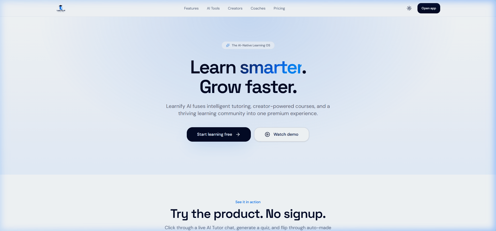

<div align="center">


# Learnify AI

**The AI-Native Learning Operating System**

[](https://www.typescriptlang.org/)
[](https://react.dev/)
[](https://supabase.com/)
[](https://vercel.com/)
[](https://github.com/Vishwajeetsrk/learnifyai)
[](LICENSE)

[🚀 Live Demo](https://www.learnifyai.in/) · [🐛 Report Bug](https://github.com/Vishwajeetsrk/learnifyai/issues) · [✨ Request Feature](https://github.com/Vishwajeetsrk/learnifyai/issues/new?template=feature_request.md)

</div>

---

## 🎯 What is Learnify AI?

Learnify AI is a **full-stack, AI-powered learning platform** that combines intelligent tutoring, creator tools, gamification, and career growth into one premium experience.

### 🎥 Platform Demo

<div align="center">
  <a href"https://www.learnifyai.in/" target="_blank">
    
  </a>
  <p><em>👆 Click to open the live demo</em></p>
</div>

### ✨ For Learners

| Feature                            | Description                                                                                                                                                                                                                                      |
| ---------------------------------- | ------------------------------------------------------------------------------------------------------------------------------------------------------------------------------------------------------------------------------------------------ |
| 🤖 **AI Tutor**                    | Personalized 1-on-1 tutoring with multi-model support (Gemini, Groq, OpenRouter)                                                                                                                                                                 |
| 💼 **Career Studio (11-in-1)**     | Resume Builder, ATS Checker, Voice Interview Coach, Career Roadmap, Portfolio Builder, **LinkedIn Optimizer**, **Career & Salary Analytics**, **Internship Tracker**, **Skill Gap Analysis**, **Career Finder (Ikigai)**, and **Skill Roadmaps** |
| 🎓 **System Design Academy**       | 10 topics (Netflix, Uber, WhatsApp, YouTube, Twitter, Amazon, Google, Instagram, Slack, Zoom) with animated architecture diagrams, knowledge graph, voice narration, quiz                                                                        |
| 🧠 **Visual Learning**             | Concept Graph (force-directed knowledge map), Explain Like I'm 12, Dynamic Learning Map, built into every lesson                                                                                                                                 |
| 🏆 **Gamification Dashboard**      | XP progress, streak calendar, badge showcase, leaderboard rank, upcoming rewards — accessible from course player                                                                                                                                 |
| 🗺️ **Career Path Course Catalog**  | 9 career path filters (Frontend, Backend, Full Stack, etc.), level filters, sort, Trending/Recommended rails                                                                                                                                     |
| 🪄 **Cheat Sheet Generator**       | Real brand logos (HTML, Supabase, Firebase, ChatGPT, etc.), timeline layout, Save to Library, beautiful Print/PDF export, Share button                                                                                                           |
| 🎓 **12 Launch Course Categories** | Full Stack, Python, AI & Prompting, Data Science, Cyber Security, UI/UX, Resume, Interview, Roadmaps, Marketing, Freelancing, Personal Branding                                                                                                  |
| 📚 **Documentation Hub (`/docs`)** | Comprehensive platform guides for Students, Creators (Free/Paid), and Coaches (Free/Paid)                                                                                                                                                        |
| 🎥 **Interactive Watch Demo**      | Guided modal tour covering platform features, credit usage, and creator earning model                                                                                                                                                            |
| 📱 **Mobile App (Android & iOS)**  | Mobile app showcase with VIP early access registration                                                                                                                                                                                           |
| 📜 **Certificate Accreditation**   | Cryptographic QR verification with MSME Udyam, NSDC Skill India, and ISO 9001 accreditation guide                                                                                                                                                |
| 🎥 **Advanced Video Player**       | Captions (VTT/SRT), searchable transcript, PiP, keyboard shortcuts, screenshots, bookmarking, focus/theater mode, auto-next lesson                                                                                                               |
| 💻 **Code Playground**             | Monaco editor with 25+ languages, AI debug panel, web preview, API tester, AI assistant                                                                                                                                                          |
| 📝 **Smart Notes**                 | Auto-generated flashcards, summaries, and quizzes from any lesson                                                                                                                                                                                |
| 🏆 **Gamification Engine**         | XP, streaks, badges, leaderboards, XP Store with server-side purchase tracking, interactive AI quizzes, confetti celebrations                                                                                                                    |
| 🛍️ **XP Store**                    | Spend XP on premium perks (themes, discounts, credits, badges) — server-side purchase history with admin panel at `/admin/store`                                                                                                                 |
| 📅 **Calendar Sync**               | Browser-based `.ics` generator to sync events to Google, Apple, and Outlook calendars                                                                                                                                                            |
| 💰 **Wallet & AI Credits**         | Starter 500 AI credits/mo, creator earnings & withdrawals, Cashfree gateway integration                                                                                                                                                          |
| 📋 **Billing Dashboard**           | Plan management, Cashfree invoices, coupons (`WELCOME20`, `STUDENT50`, `LAUNCH20`)                                                                                                                                                               |
| 🎯 **Onboarding Wizard**           | 8-step guided setup with AI coach, daily habits tracking, and project creation                                                                                                                                                                   |
| 🗺️ **Interactive Product Tours**   | Role-specific guided tours (Student, Creator, Admin, AI Tools) with spotlight tooltips                                                                                                                                                           |
| 🌐 **Multi-Language (11 langs)**   | Full UI i18n with English, Hindi, Bengali, Tamil, Telugu, Marathi, Gujarati, Kannada, Spanish, French, German                                                                                                                                    |
| 📝 **Blog**                        | Read articles, like posts, and comment with community                                                                                                                                                                                            |

### 🎓 For Creators

| Feature                            | Description                                                                                                          |
| ---------------------------------- | -------------------------------------------------------------------------------------------------------------------- |
| 🏗️ **Creator Studio**              | Build courses, add lessons, manage quizzes and assignments                                                           |
| 🪄 **AI Course Builder**           | Auto-generate course outlines, lessons, and thumbnails                                                               |
| 🎓 **Certificate Templates**       | Assign certificate templates to courses from course detail page                                                      |
| 🎨 **Certificate Designer Studio** | html2canvas-based editor with 5 templates, interactive canvas, properties panel, PNG/PDF export, bulk CSV generation |
| 🧑‍💼 **Coaching Hub**                | Book 1-on-1 sessions, schedule slots, chat, AI roadmap generator                                                     |
| 🗺️ **Manual Roadmap Builder**      | Create custom learning roadmaps with phases, skills, milestones                                                      |
| 👥 **Cohorts**                     | Live group learning with community spaces                                                                            |
| 📊 **Earnings Dashboard**          | Revenue tracking, payouts, and invoices                                                                              |

### 🌐 Platform-Wide

| Feature                       | Description                                                                                                                                                                                        |
| ----------------------------- | -------------------------------------------------------------------------------------------------------------------------------------------------------------------------------------------------- |
| 💬 **Community Feed**         | Social learning with posts, comments, likes, edit/delete, rich text editor                                                                                                                         |
| 💬 **Community Chat**         | Real-time live presence chat where messages automatically delete after 24 hours                                                                                                                    |
| 📥 **Inbox**                  | Direct messaging between coaches and students                                                                                                                                                      |
| ⚙️ **Admin Panel**            | Dashboard, wallet verification, certificates (templates/canva/designer/bulk/analytics/categories), email templates, content management, subscription management, coupon CRUD, student verification |
| 📊 **Subscription Analytics** | MRR, ARR, subscriber counts, payment events, plan breakdown                                                                                                                                        |
| 📧 **Email System**           | Professional branded emails (Welcome, Certificates, Subscriptions) — Resend primary, Gmail/Brevo fallback                                                                                          |
| 🪄 **Premium UI/UX**          | 3D interactive cursor, magnetic buttons, particle trails, and 60FPS glassmorphism                                                                                                                  |
| 📄 **Legal Pages**            | Privacy Policy, Terms of Service, Refund Policy                                                                                                                                                    |
| 🔗 **Username Profiles**      | Public profiles accessible via `/u/@username` URL format                                                                                                                                           |
| 🌐 **WCMS**                   | 14-block page builder, media library, features catalog, menu manager, blog system                                                                                                                  |
| 🎯 **Interactive Tours**      | Role-specific product tours with spotlight cutout and auto-skip for missing targets                                                                                                                |

---

## 🎨 Certificate Designer Studio

Full Canva-style certificate editor with **5 built-in templates** (Navy Gold, Navy Blue, Royal Purple, Forest Green, Crimson Gold). Interactive canvas with click-to-select elements, properties panel, and content manager.

### How It Works

1. **Select Template** — Choose from 5 professionally designed templates with unique color schemes and decorations
2. **Edit Content** — Use the Content Manager to update student name, course name, certificate ID, dates, and instructor details
3. **Click to Select** — Click any element on the canvas to see its properties (font, color, alignment)
4. **Dynamic Variables** — Use `{{student_name}}`, `{{course_name}}`, `{{cert_id}}`, `{{completion_date}}`, `{{verification_link}}`
5. **Export** — Download as high-res PNG (2x) or PDF (A4 landscape) via html2canvas
6. **Bulk Generate** — Upload CSV with student data for batch certificate issuance

### Editor Features

| Feature                    | Description                                                        |
| -------------------------- | ------------------------------------------------------------------ |
| **5 Templates**            | Navy Gold, Navy Blue, Royal Purple, Forest Green, Crimson Gold     |
| **Interactive Canvas**     | Click-to-select elements with visual selection handles             |
| **Left Panel**             | Templates, Elements (badges/seals/dividers), Text presets, Uploads |
| **Right Panel**            | Properties (font/color/position) + Content Manager (form fields)   |
| **Background Decorations** | Per-template SVG sweeps, triangles, ribbons, gold borders          |
| **Badge & Ribbon**         | Gold scallop seal with crown/trophy/code icons                     |
| **Center Seal**            | Laurel wreath with Learnify AI logo                                |
| **QR Code**                | Auto-generated verification QR with live URL                       |
| **Bottom Features Bar**    | AI-Powered, Industry Relevant, Career Focused, Lifetime Access     |
| **PNG Export**             | 2x resolution via html2canvas                                      |
| **PDF Export**             | A4 landscape via browser print dialog                              |

### Uploading Your 30+ Canva Templates

To make all your Canva designs editable:

1. **Export from Canva** — For each template, remove all text elements and export as PNG (background only)
2. **Go to Admin → Certificates → Certificate Designer**
3. **Click "Upload Template"** and select your background image
4. **Position fields** — Add text elements and drag them to match your design
5. **Save** — The template is stored in the `canva_templates` DB table
6. **Repeat** for all 30+ templates

### Database Schema

```sql
CREATE TABLE canva_templates (
  id UUID PRIMARY KEY DEFAULT gen_random_uuid(),
  name TEXT NOT NULL,
  category TEXT DEFAULT 'Professional',
  bg_image_url TEXT NOT NULL,
  thumbnail_url TEXT,
  fields_json JSONB DEFAULT '{}',    -- field positions, fonts, colors
  theme_colors JSONB DEFAULT '{}',   -- color scheme
  created_at TIMESTAMPTZ DEFAULT now(),
  updated_at TIMESTAMPTZ DEFAULT now(),
  created_by UUID REFERENCES auth.users(id)
);
```

---

## 🚀 Upcoming Master Sprints

For developers and AI agents (Lovable, Cursor, Claude Code) looking to implement massive feature overhauls, please refer to the following sprint specifications:

- [Gamification 4.0 Master Prompt](./GAMIFICATION_MASTER_PROMPT.md)
- [Mobile UI/UX & Functional Fix Sprint](./MOBILE_UX_SPRINT.md)

---

## 💻 Code Playground Languages

Learnify AI's playground features **multi-language compilation** powered by Wandbox, Judge0, and Piston APIs. Supported runtimes:

| Language       | Badge                                                                                                                | Compiler / Runtime      |
| :------------- | :------------------------------------------------------------------------------------------------------------------- | :---------------------- |
| **JavaScript** |  | Node.js 20.17           |
| **TypeScript** |   | TypeScript 5.6          |
| **Python**     |              | CPython 3.12.7 (Stable) |
| **Java**       |                   | OpenJDK JDK 22          |
| **C++**        |            | GCC 14                  |
| **C**          |                              | GCC 14 C                |
| **C#**         |                    | Mono 6.12               |
| **Go**         |                          | Go 1.23.2               |
| **Rust**       |                    | Rust 1.82.0             |
| **PHP**        |                        | PHP 8.3.12              |
| **Ruby**       |                     | Ruby 4.0.2              |
| **Swift**      |                  | Swift 6.0.1             |
| **Kotlin**     |               | Kotlin 2.0.21           |
| **Dart**       |                     | Dart 3.5.3              |
| **Bash**       |                | Bash 5.2                |
| **SQL**        |                  | SQLite 3.46.1           |
| **Zig**        |                       | Zig 0.13.0              |
| **Julia**      |                 | Julia 1.10.5            |
| **Lua**        |                        | Lua 5.4.7               |
| **Haskell**    |           | GHC 9.10.1              |
| **Elixir**     |              | Elixir 1.17.3           |
| **Nim**        |                        | Nim 2.2.10              |
| **R**          |                              | R 4.4.1                 |

---

## 🛠️ Tech Stack

| Layer          | Technology                                                                      |
| -------------- | ------------------------------------------------------------------------------- |
| **Framework**  | React 19 + TanStack Start (SSR)                                                 |
| **Routing**    | TanStack Router (file-based)                                                    |
| **Styling**    | Tailwind CSS v4 + Shadcn UI                                                     |
| **State**      | TanStack Query + React Context                                                  |
| **Database**   | Supabase (PostgreSQL + Auth + Storage)                                          |
| **AI**         | OpenRouter, Gemini, Groq, NVIDIA (multi-provider fallback)                      |
| **Payments**   | Cashfree (Recurring Subscriptions + Wallet + Payouts)                           |
| **Embeddings** | Gemini text-embedding-004 + pgvector                                            |
| **Email**      | Resend (primary) ←→ Gmail SMTP ←→ Brevo (fallback chain, per-provider timeouts) |
| **Code Exec**  | Wandbox / Piston / Judge0 (multi-executor fallback)                             |
| **Canvas**     | html2canvas (certificate capture with selection handles)                        |
| **PDF Export** | html2canvas + browser print (high-res A4 landscape certificate generation)      |
| **Bulk Gen**   | JSZip (CSV → ZIP of PDFs for batch certificate issuance)                        |
| **Testing**    | Playwright (E2E)                                                                |
| **Deployment** | Vercel (Edge Network + Serverless Functions)                                    |

---

## 🚀 Getting Started

### Prerequisites

- Node.js v18+
- Supabase project (PostgreSQL database instance + Auth + Storage)
- Cashfree merchant account (for payments)
- At least one AI provider key (Gemini, OpenRouter, Groq, or NVIDIA)
- Gmail App Password or Resend API key (for emails)

### Setup & Run Guide

Follow these steps to set up and run the platform locally:

#### 1. Clone & Install Dependencies

```bash
# Clone the repository
git clone https://github.com/Vishwajeetsrk/learnifyai.git
cd learnifyai

# Install dependencies (pnpm recommended — Vercel uses pnpm)
pnpm install
```

#### 2. Environment Configuration

Duplicate the example environment file and update it with your actual service credentials:

```bash
cp .env.example .env.local
```

Then edit `.env.local` to fill in your API keys, database URL, and Supabase credentials.

#### 3. Database Setup & Migrations

Before running the app, create the database schema in your Supabase project. You can run migrations using the Supabase CLI:

```bash
npx supabase db push
```

Alternatively, to directly synchronize migrations via a PostgreSQL connection client:

```bash
node scripts/sync-migrations.cjs
```

#### 4. Seed Initial Data

Once migrations have finished, seed the essential starting records (pricing plans, courses, events, jobs):

```bash
# Seed pricing plans (Free, Pro, Career Pro, Enterprise)
node seed_pricing_plans.cjs

# Seed launch event and job openings
node seed-event-job.mjs

# (Optional) Seed standard developer courses
node scripts/seed_courses.mjs
```

#### 5. Run the Local Development Server

Start the client application in development mode:

```bash
pnpm dev
```

Open [http://localhost:8080](http://localhost:8080) (or the port shown in your terminal) to access the application.

#### 6. Build and Preview (Production Check)

To compile a production bundle and run the server locally:

```bash
# Build the application
pnpm build

# Preview the built production output
pnpm preview
```

#### 7. Quality Checks & Verification

Keep the codebase clean and verify logic using the following quality assurance commands:

```bash
# Run linting
pnpm lint

# Format the codebase
pnpm format

# Run E2E Playwright tests
npx playwright test
```

### Environment Variables

| Variable                        | Required | Description                                                                  |
| ------------------------------- | -------- | ---------------------------------------------------------------------------- |
| `DATABASE_URL`                  | ✅       | PostgreSQL connection string (for running migrations & seeds)                |
| `VITE_SUPABASE_URL`             | ✅       | Supabase project URL                                                         |
| `VITE_SUPABASE_PUBLISHABLE_KEY` | ✅       | Supabase anon/public key                                                     |
| `SUPABASE_SERVICE_ROLE_KEY`     | ✅       | Supabase service role key (secure server-side access)                        |
| `OPENROUTER_API_KEY`            | ⚡       | OpenRouter API key for AI tutoring and features                              |
| `GEMINI_API_KEY`                | ⚡       | Google Gemini API key (fallback or primary AI model)                         |
| `GROQ_API_KEY`                  | ⚡       | Groq API key (for fast inference models)                                     |
| `NVIDIA_API_KEY`                | ⚡       | NVIDIA API key (for Llama models via NVIDIA AI)                              |
| `CASHFREE_APP_ID`               | 💰       | Cashfree payment gateway App ID                                              |
| `CASHFREE_SECRET_KEY`           | 💰       | Cashfree payment gateway Secret Key                                          |
| `CASHFREE_WEBHOOK_SECRET`       | 💰       | Cashfree webhook signature verification secret                               |
| `VITE_APP_URL`                  | 🌐       | Base URL for webhook callbacks and email links                               |
| `GMAIL_EMAIL`                   | 📧       | Gmail address for sending automated transactional emails                     |
| `GMAIL_APP_PASSWORD`            | 📧       | Gmail 16-character App Password                                              |
| `RESEND_API_KEY`                | 📧       | Resend API key (primary email provider — recommended)                        |
| `EMAIL_FROM`                    | 📧       | Sender email address (e.g. `noreply@learnify.ai` or `onboarding@resend.dev`) |
| `BREVO_SMTP_KEY`                | 📧       | Brevo SMTP key (fallback email provider)                                     |
| `BREVO_SMTP_SERVER`             | 📧       | Brevo SMTP server (e.g. `smtp-relay.brevo.com`)                              |
| `BREVO_SMTP_PORT`               | 📧       | Brevo SMTP port (e.g. `587`)                                                 |
| `BREVO_SMTP_LOGIN`              | 📧       | Brevo SMTP login                                                             |

---

## 📁 Project Structure

```
src/
├── routes/                  # File-based routing (TanStack Router)
│   ├── __root.tsx          # Root layout with providers + ProductTour
│   ├── index.tsx           # Landing page
│   ├── login.tsx           # Authentication
│   ├── signup.tsx          # Registration
│   ├── pricing.tsx         # 3D pricing plans with feature comparison
│   ├── p.$slug.tsx         # Dynamic WCMS public pages
│   ├── u/
│   │   ├── $id.tsx         # Public profile (UUID) with banner error handling
│   │   └── @$username.tsx  # Username redirect → UUID
│   ├── _authenticated/     # Protected routes
│   │   ├── dashboard.tsx   # Learner dashboard
│   │   ├── onboarding.tsx  # 8-step guided setup wizard
│   │   ├── courses.$slug.tsx  # Course player
│   │   ├── ai.tsx          # AI tutor chat
│   │   ├── playground.*.tsx   # Code playground
│   │   ├── billing.tsx     # Billing & subscription dashboard
│   │   ├── coaching.tsx      # Coaching hub (5 tabs)
│   │   ├── resume-builder.tsx   # AI-powered resume builder
│   │   ├── ats-checker.tsx      # ATS score analyzer
│   │   ├── career-roadmap.tsx   # Career roadmap generator (structured JSON)
│   │   ├── interview.tsx        # Interview prep (8 roles, 3 modes, AI eval)
│   │   ├── challenges.tsx       # Coding challenges (daily, filters, points)
│   │   ├── portfolio-builder.tsx # Portfolio builder
│   │   ├── verify-student.tsx   # Student email verification
│   │   ├── studio.tsx       # Creator studio
│   │   ├── wallet.tsx       # Wallet & payments
│   │   ├── admin.tsx       # Admin panel
│   │   ├── admin.content.tsx  # Content manager (16 tabs + WCMS)
│   │   └── admin/
│   │       └── subscriptions.tsx  # Subscription analytics
│   └── api/                # Server-side API routes
│       ├── cron/
│       │   ├── check-subscriptions.ts  # Cron: expire overdue subscriptions
│       │   └── retry-cert-emails.ts  # Cron: retry failed certificate emails
│       └── webhooks/
│           ├── cashfree.ts              # One-time payment webhook
│           └── cashfree-subscription.ts # Subscription webhook
├── components/             # Reusable UI components
│   ├── ui/                 # Shadcn UI primitives
│   ├── playground/
│   │   ├── StandardIDE.tsx      # File tabs, context menu, zoom
│   │   ├── WebIDE.tsx           # Sandpack with device preview
│   │   ├── AIPanel.tsx          # AI code actions
│   │   ├── AIAssistantPanel.tsx # AI chat assistant (6 actions)
│   │   └── APITesterPanel.tsx   # HTTP request tester
│   ├── admin/
│   │   ├── PageManager.tsx      # WCMS page editor (14 block types)
│   │   ├── MediaLibrary.tsx     # Media upload/management
│   │   ├── FeaturesCatalog.tsx  # Feature catalog with icons/colors
│   │   ├── MenuManager.tsx      # Navigation menu editor
│   │   └── RoadmapBuilder.tsx   # Manual roadmap builder
│   ├── ProductTour.tsx     # Interactive guided tours (10 steps, role-based)
│   ├── ResumeFileUpload.tsx # Drag-and-drop PDF/DOCX upload for auto-fill
│   ├── wcms/BlockRenderer.tsx  # WCMS block renderer (14 types)
│   ├── FilePreview.tsx     # PDF/DOCX/image/text preview
│   ├── Skeletons.tsx       # Reusable skeleton loaders
│   ├── SiteHeader.tsx      # Navigation header
│   ├── SiteFooter.tsx      # Footer
│   ├── GlobalSupportAgent.tsx  # AI support chat
│   └── CustomVideoPlayer.tsx   # YouTube/HTML5 player
├── hooks/                  # Custom React hooks
│   ├── use-auth.tsx        # Authentication context (with role fetching)
│   ├── use-theme.tsx       # Theme management
│   ├── use-cursor.tsx      # Cursor state context
│   ├── use-motion-pref.tsx # Reduced motion preference
│   └── use-wcms-public.tsx # WCMS public data hooks
├── lib/                    # Server functions & utilities
│   ├── file-parser.ts      # PDF/DOCX text extraction (pdfjs-dist + mammoth)
│   ├── resume.functions.ts # Resume generation, ATS scoring, career roadmap, portfolio
│   ├── cert.functions.ts   # Certificate CRUD + email sending
│   ├── subscription.functions.ts     # Subscription CRUD + Cashfree
│   ├── subscription-email.functions.ts # Subscription email notifications
│   ├── payment.functions.ts  # Wallet payments + payouts
│   ├── welcome-email.functions.ts  # Email system (multi-provider + templates)
│   ├── onboarding.functions.ts  # Onboarding progress + AI coaching
│   ├── profile-save.functions.ts  # Profile field updates
│   ├── wcms.functions.ts  # WCMS server functions (17 functions)
│   ├── wcms-public.functions.ts  # WCMS public API (4 endpoints)
│   ├── admin-content.functions.ts  # Admin CRUD (bypasses RLS)
│   ├── gamification.functions.ts  # XP, streaks, achievements
│   ├── agent.functions.ts  # Coding mentor agent
│   ├── support-agent.functions.ts  # Support agent
│   ├── user-ai.ts          # Multi-provider AI fallback
│   └── playground/         # Code execution engines
├── integrations/           # External service configs
│   └── supabase/           # Supabase client & types
└── assets/                 # Static assets (logos, images)
```

---

## 🏗️ Architecture

```
┌─────────────────────────────────────────────────┐
│                    Frontend                      │
│  React 19 + TanStack Start + Tailwind CSS v4    │
├─────────────────────────────────────────────────┤
│                    Backend                       │
│  TanStack Server Functions + Vercel Edge        │
├─────────────────────────────────────────────────┤
│                    Database                      │
│  Supabase (PostgreSQL + Auth + Storage)         │
├─────────────────────────────────────────────────┤
│                    AI Layer                      │
│  OpenRouter ←→ Gemini ←→ Groq (fallback chain)  │
├─────────────────────────────────────────────────┤
│                   Payments                       │
│  Cashfree (Subscriptions + Wallet + Payouts)    │
├─────────────────────────────────────────────────┤
│                 Email System                     │
│  Resend (primary) ←→ Gmail SMTP ←→ Brevo        │
│  20s total timeout + per-provider 8s timeouts   │
│  Admin-editable templates stored in PostgreSQL  │
├─────────────────────────────────────────────────┤
│                  Deployment                      │
│  Vercel (Edge Network + Serverless Functions)   │
└─────────────────────────────────────────────────┘
```

---

## 📋 Available Scripts

| Command                | Description              |
| ---------------------- | ------------------------ |
| `pnpm dev`             | Start Vite dev server    |
| `pnpm build`           | Production build         |
| `pnpm preview`         | Preview production build |
| `pnpm lint`            | Run ESLint               |
| `pnpm format`          | Run Prettier             |
| `npx playwright test`  | Run E2E tests            |
| `npx supabase db push` | Run database migrations  |

---

## 🤝 Contributing

See [CONTRIBUTING.md](CONTRIBUTING.md) for guidelines.

---

## 🔐 Security

To report a vulnerability, see [SECURITY.md](SECURITY.md).

---

---

## 📄 License

MIT License. See [LICENSE](LICENSE) for details.

---

## 📋 Changelog

### v5.1.0 (July 2026) — Route Overhaul, PostgREST Fix, Global Avatar Normalization & Emoji-Free AI

- ✅ **Dynamic Routing Fix**: Renamed layout route `courses.tsx` to index route `courses.index.tsx` so TanStack Router can properly separate the index directory from dynamic `$slug` matching.
- ✅ **Global Avatar Normalization**: Added `optimizeAvatarUrl` in `src/lib/utils.ts` and integrated it directly into `<AvatarImage>` to dynamically clean up legacy Dicebear v7 URLs and upgrade them to v10.x formats to avoid 400 Bad Request errors.
- ✅ **PostgREST Query Fix**: Refactored `creator_applications` queries in `src/routes/_authenticated/admin.tsx` to query applications and profiles separately, bypassing the missing foreign-key join constraints in PostgREST that caused 400 errors.
- ✅ **Emoji-Free AI Prompts**: Modified system prompts for all 10 platform AI assistants (`support-agent`, `resume`, `playground-ai`, `playground/ai`, `onboarding`, `market-intel`, `learning-assistant`, `career-coach`, `ai-tools`, `agent`) to strictly enforce that no emojis are generated in response contents.
- ✅ **Lucide SVG replacements in AI Tools**: Cleaned up the `ai-tools.tsx` tab headers and filter chips, swapping out emojis for premium Lucide vector SVGs (`Zap`, `BookOpen`, `Briefcase`, `Code2`).
- ✅ **Cheat Sheet Emoji Cleanup**: Removed emoji indicators from headings, gotcha badges (`❌ Bad` / `✅ Good` to `Incorrect` / `Correct`), and card headers in `CheatSheetGenerator.tsx`, ensuring a premium vector-driven appearance.

### v5.0.0 (July 2026) — Enterprise Invoice 2.0, Cheat Sheet Overhaul, Avatar System Fix

- ✅ **Enterprise Invoice Designer 2.0**: Built a Canva-like dual-pane invoice designer in Admin → Content Manager. Features: 5 templates (Modern, Minimal, Corporate, Luxury, Dark), live canvas preview, logo + digital signature upload to Supabase Storage, GSTIN/address/colors/watermark/QR toggle/terms settings, saved to `site_settings` table, full audit logging via `admin_audit_logs`.
- ✅ **Invoice PDF Engine Overhaul** (`invoice-pdf.ts`): Enterprise-grade jsPDF generator with CGST/SGST tax breakdown, QR code verification, digital signature block, template branding (colors, logo, watermark), and proper verification URL pointing to `learnifyai.com/verify/invoice/...`.
- ✅ **Public Invoice Verification Page** (`/verify/invoice/$id`): Secure public route that shows invoice status, metadata, and verification seal — no auth required.
- ✅ **Cheat Sheet Generator Overhaul** (`CheatSheetGenerator.tsx`): Full rewrite with 20+ real inline SVG brand logos (HTML5, CSS3, JS, TS, React, Vue, Angular, Node.js, Python, Supabase, Firebase, Docker, Git, MySQL, PostgreSQL, MongoDB, AWS, WordPress, Figma, Canva, ChatGPT, Excel, GitHub, Tailwind, Next.js, Vite, Redis, Kubernetes). Timeline layout for Core Concepts. Save to Library via localStorage with Bookmark toggle. Beautiful styled Print view (not raw JSON). Downloadable print-ready HTML for PDF. Share button with Web Share API / clipboard fallback. Timestamp in toolbar.
- ✅ **XP Store Avatar Fix**: Removed `InteractiveAvatar` component (SVG eyes/mouth overlay was rendering on top of avatar faces at wrong coordinates). Replaced with clean edge-to-edge `` tags. Avatar cards now use premium styling: `scale-110` hover zoom, dark "Unlock" overlay, `ring-4` active glow, rounded 2xl. Section renamed from "Interactive Avatars" → **"3D Profile Avatars"**.
- ✅ **Video Player Bookmark Removed**: Cleaned up unused bookmark control from the video player UI.

- ✅ **Certificate Auto-Email**: Fixed `issueAndEmailCertificate` server function to actually send emails using the 5-provider fallback chain (Gmail → Resend API → Brevo → Resend SMTP → Brevo SMTP). Previously was a placeholder that only logged to console. Now sends a branded HTML email with certificate ID, score, and verification link on every issuance.
- ✅ **Certificate Email Template**: Built a dedicated HTML email template for auto-issued certificates with Learnify AI branding, gradient header, certificate details table (ID, date, score), and "View & Download Certificate" CTA button.
- ✅ **Admin Template Grid Redesign**: Improved `CertDesignerAdmin` with category filter chips (showing counts), search with icon, stat bar, lazy-loaded images, hover overlay with Preview/Edit/Delete buttons, category badges with color coding, and field count display.
- ✅ **Multi-Format Export**: Designer supports 4 export formats — High-Res PNG (html2canvas-pro 3x), Print PDF (jsPDF A4 landscape), Vector SVG (DOM clone serialization), and Animated GIF (canvas data URL).
- ✅ **File Upload for Logo & Signature**: Replaced placeholder text inputs with file upload buttons for Logo (org_logo), Signature, Badge, and Image elements. Real images render directly on canvas via `URL.createObjectURL`.
- ✅ **Position & Dimensions Controls**: Added numeric X/Y/Width/Height inputs in DesignerSidebar Properties tab for pixel-perfect element placement with live canvas updates.
- ✅ **Zoom Controls**: Upgraded canvas toolbar with zoom buttons (−, +), reset to 100%, and smooth scaling up to 200%.
- ✅ **Keyboard Shortcuts**: Added keydown listeners for Delete/Backspace to remove selected elements, and Escape to deselect.
- ✅ **Desktop Drag & Drop**: Dragging image files from desktop onto the canvas either sets the background image (if dropped on background) or inserts a new draggable image element.

### v4.9.0 (July 2026) — Zero Build Errors, NVIDIA AI Provider, 40 DB Migrations Applied

- ✅ **Zero TypeScript Build Errors**: All 53 TS errors eliminated from the codebase. Fixed: nullability in Insert types across all tables (nullable → `T | null`, hasDefault → `T`, required → `T`), regenerated types.ts with 4 missing tables (`admin_audit_logs`, `concept_graphs`, `explanations_cache`, `store_items`), fixed admin.tsx ExcelJS vertical alignment `"center"`→`"middle"`, `aiReq24hQuery.data ?? 0` guard, `userMap` scope, `getAvatar` null→undefined, `creatorApps` type cast, fixed career-studio.tsx imports, portfolio-builder.tsx `any` annotation, AnnouncementBroadcast null-coalescing.
- ✅ **NVIDIA AI Provider Wired**: Added `NVIDIA_API_KEY` to environment config. NVIDIA added as a first-class AI provider in `src/routes/api/chat.ts` (PROVIDERS object + resolveProvider fallback) and `src/lib/agent.functions.ts` (AI_PROVIDERS array + NVIDIA_URL constant). Available models: `meta/llama-3.3-70b-instruct`, `nvidia/llama-3.1-nemotron-70b-instruct`.
- ✅ **40 DB Migrations Applied to Production**: Ran all pending migrations covering billing, pricing, WCMS, onboarding, blog, concept_graphs, admin_audit_logs, store_items, and more. Production schema now fully synced with migrations.
- ✅ **MIND_MAP.md Created**: Comprehensive project map for AI agent navigation, covering all routes, components, lib modules, integrations, hooks, types and root config files.
- ✅ **`MigrationPlan.md` Audit & Plan**: Complete review of all 118 DB tables, migration status, and pending tasks documented in `plans/TransformationPlan.md`.

### v4.8.0 (July 2026) — Visual Learning Integration, Owner Video Player Fix, Build & AI Tutor Fixes

- ✅ **Visual Learning Tab in Course Player**: New "Visual" tab in `LessonAiTabs` rendered via `VisualLearningPanel` — two sub-tabs: Concept Map (force-directed knowledge graph with `@xyflow/react`) and Explain Like I'm 12 (AI-generated simplified explanations). Props wired: `lessonId`, `courseId`, `lessonTitle`, `lessonContent`.
- ✅ **Owner Video Player Control Fixed**: `CoursePlayer` `key` prop now includes `isAdmin` and `user?.id` so the player properly re-mounts when admin/owner status loads after initial render. Previously, if roles loaded asynchronously, `restrictDownload`/`restrictSpeed` would remain locked for admins/course owners.
- ✅ **YouTube Error 153 Fixed**: Added `origin: window.location.origin` to `playerVars` in `CustomVideoPlayer` and appended `origin=` param to iframe `src` in `AdvancedVideoPlayer` to prevent embed domain mismatch errors. Custom error handler added for code 153.
- ✅ **Build Error Fixed**: Changed `css.transformer` from `"postcss"` to `"lightningcss"` in Vite config — PostCSS could not parse Tailwind v4's `@property`/`@utility` CSS output. LightningCSS handles modern CSS syntax correctly. Build now succeeds.
- ✅ **AI Tutor Bug Fixes** (`ai.tsx`): Fixed `conversationId` → `activeId` (undefined variable in mobile sidebar highlight). Fixed `c.created_at` → `c.updated_at` (property doesn't exist on Conversation type — was showing "Invalid Date").

### v4.7.0 (July 2026) — Community Hub Responsive, Portfolio Builder SVG Logos, Admin Billing & Subscriptions OS

- ✅ **Community Hub Mobile-Responsive**: Tab bar compact with horizontal scroll on mobile (`community-hub.tsx`). Post composer actions full-width on small screens (`community-feed.view.tsx`). Leaderboard podium fixed to `w-20 sm:w-28`, rank cards with text truncation, list XP compact (`leaderboard.view.tsx`). Challenge cards `p-3 sm:p-4`, icons shrink on mobile, buttons `h-8` (`challenges.tsx`). Inbox notification actions `flex-row sm:flex-col`, tabs `flex-1`, text truncated (`inbox.tsx`).
- ✅ **Portfolio Builder SVG Skill Logos**: Added `SKILL_BRANDS` map with 25+ brand-colored SVG icons (Python, SQL, Excel, Power BI, JavaScript, HTML, CSS, GitHub, VS Code, Figma, Docker, etc.). `SkillLogo` component renders inline SVGs with brand-colored rounded squares + white letter labels. `whileHover` (`scale: 1.05, y: -2`) + `whileTap` (`scale: 0.95`) framer-motion animations on every skill/soft-skill/tool badge. HTML export now includes inline SVG logos in exported `.html` files.
- ✅ **Admin Billing Upgrades** (`admin/billing.tsx`): Manual Invoice — user search dropdown from `profiles` table with invoice preview + send email button. Process Refund — user + invoice search dropdowns with refund reason picklist (deficiency, technical, billing, other) + send email confirmation. Coupon editor — delete button added. Cashfree Razorpay note added to payment info section. Payments table — User column added showing full name/email/mobile.
- ✅ **Admin Subscriptions Upgrades** (`admin/subscriptions.tsx`): "Last Month" date preset added to date range picker. "Admin Only" badge removed from plan display. Mobile phone number field added to export CSV.
- ✅ **Billing Functions** (`billing.functions.ts`): `exportBillingData` and `getPaymentLogs` now LEFT JOIN `profiles` table to include `full_name`, `email`, `mobile` in billing exports and payment logs.
- ✅ **New Migrations Added**: `20270721000000_admin_audit_logs.sql` (audit logging infrastructure), `20270722000000_cron_jobs.sql` (scheduled tasks), `20270723000000_store_items.sql` (XP Store items table).

### v4.6.1 (July 2026) - Bug Fixes: XP Store, Player, YouTube Live Filter & Build Cleanup

- ✅ **XP Store Server-Side Purchase Fix**: `xp_purchases` table properly typed via `as any` casts in `gamification.functions.ts`. Better error message when table is missing ("run migrations"). Store page now fetches purchases from server, falls back to localStorage.
- ✅ **YouTube Live Stream Filter**: `ytSearchTopVideo` now filters `liveBroadcastContent !== "none"` to prevent picking live/upcoming broadcasts whose recordings become unavailable. Same filter applied in `course-builder.functions.ts` chapter-level search.
- ✅ **YouTube Player Error Messages**: `CustomVideoPlayer` now shows specific messages per error code (100: removed/private, 101/150: live stream ended or restricted, 5: browser issue) instead of generic "Video failed to load."
- ✅ **Career Roadmap Bookmark Import Fixed**: Added missing `Bookmark` import from `lucide-react` in `career-roadmap.tsx`.
- ✅ **AI Tools useEffect Import Fixed**: Added missing `useEffect` import from React in `ai-tools.tsx`.
- ✅ **WatchDemoModal Promise Type Fix**: Replaced `.catch()` on Supabase `PromiseLike` with async/await.
- ✅ **CustomVideoPlayer useRef Initial Value**: Fixed `useRef<ReturnType<typeof setTimeout>>()` with `(undefined)` initializer.
- ✅ **KnowledgeGraph useRef Initial Value**: Same fix for `useRef<number>()` → `useRef<number | undefined>(undefined)`.
- ✅ **Dashboard Progress Component**: Replaced non-existent `indicatorClassName` prop with plain Tailwind div.
- ✅ **Course Player Duration Fix**: Changed `l.duration` to `l.duration_minutes` to match DB column name.
- ✅ **RevenueDashboard Invoice Data Fix**: Fixed `doInvoices()` result usage to match returned shape `{ invoices, total }`.
- ✅ **Build Error Cleanup**: Reduced TS errors from 48→29 (remaining are pre-existing `Json` type-narrowing in `course.$projectId.tsx`, `studio.$projectId.tsx`, `canva-cert.functions.ts`).

### v4.6.0 (July 2026) - XP Store, System Design Academy, Course Catalog & Video Player Overhaul

- ✅ **XP Store Server-Side (`/store`)**: Purchase history stored in `xp_purchases` DB table with RLS. Admin panel at `/admin/store` shows all purchases with search, pagination, stats. Server functions: `recordPurchase`, `getUserPurchases`, `getAllPurchases`. Backward-compatible `isPerkActive()` with localStorage fallback.
- ✅ **System Design Academy (10 Topics)**: `/system-design` route with full visualizer, force-directed knowledge graph, animated SVG architecture diagrams, Web Speech API voice narration (4 styles, multi-language), interactive quiz with explanations, comparison views, progress tracking. Topics: Netflix, Uber, WhatsApp, YouTube, Twitter/X, Amazon, Google Search, Instagram, Slack, Zoom.
- ✅ **Cheat Sheet Generator**: 6 toggleable sections (summary/keyPoints/architecture/comparisons/quiz/companies). PDF export via html2canvas+jsPDF, browser print. Integrated into every System Design topic page via Dialog.
- ✅ **Course Catalog Enhancement**: Career path filter (9 paths), level filter (all/beginner/intermediate/advanced), sort dropdown (newest/popular/price low-high/high-low). Trending Now rail (Hot badge), Recommended for You rail, MiniCourseCard component.
- ✅ **Advanced Video Player**: `AdvancedVideoPlayer` with TranscriptPanel (search, click-to-seek), CaptionPanel (VTT/SRT upload), AdvancedSettingsPanel (caption style, focus/theater mode), KeyboardShortcutsOverlay (23 shortcuts), screenshots, PiP, accessibility, auto-next lesson. `CoursePlayer` wrapper.
- ✅ **YouTube Auto-Enrichment Fixed**: `ytSearchTopVideo` in `youtube.functions.ts` now filters `liveBroadcastContent === "none"` to avoid picking livestreams.

### v4.5.0 (July 2026) - Credential OS 3.0 & Career OS 3.0

- ✅ **Credential OS 3.0 Admin Overhaul**: Replaced all legacy header wrappers, tab bars, and dialog chrome in `admin.certificates.tsx` with a clean Credential OS 3.0 interface — dark sidebar navigation, credential cards with status badges, search/filter bar, and invitation system.
- ✅ **5 Certificate Design Systems Added**: Launched 5 new production certificate design systems (Deep Teal, Royal Crimson, Charcoal Slate, Midnight Blue, Obsidian) with distinct field positions matching each decorative layout.
- ✅ **MobileBottomNav Dock**: Added persistent bottom navigation dock for mobile users with quick-access icons across all major sections.
- ✅ **Mobile Responsive Footer**: Fixed footer to use 2-column grid layout on mobile screens, eliminating horizontal overflow.
- ✅ **SEO & AI-Search Master Plan**: Added `robots.txt`, `sitemap.xml`, and `EducationalOrganization` JSON-LD schema for improved search engine visibility and AI search readiness.
- ✅ **Build Stability Fixes**: Excluded `preset-sites/` from Nitro `publicAssets` config to prevent ENOENT build crashes. Added build step to copy `public/preset-sites` to `dist/public`. Replaced invalid `X-Frame-Options: ALLOWALL` with valid `SAMEORIGIN` in `vercel.json`.
- ✅ **Zero TypeScript Errors**: All new files compile without TypeScript errors.

### v4.4.2 (July 2026) - Project Live Preview Iframe Fix

- ✅ **Project Live Preview Fixed**: Project page iframes now detect when `X-Frame-Options: DENY` blocks embedding (6s timeout). Shows a fallback UI with lock icon and "Open in new tab" button instead of a broken blank frame. Works in both card preview and full modal sandbox.
- ✅ **Iframe Timeout Bug Fixed**: Replaced `useEffect` dependency on `iframeLoaded` with a `useRef` so the 6-second fallback timer isn't reset by component re-renders.

### v4.4.1 (July 2026) - Animation Fixes, AI Optimize, Field-to-Element Conversion

- ✅ **Animation Button Fixed**: Replaced framer-motion `motion.div` entrance animations in admin with Tailwind `animate-in fade-in-0` CSS. Removed framer-motion dependency from admin certificates page — no more broken animations.
- ✅ **GIF Export Fixed**: "Download Animated GIF" (which produced a static image) replaced with "Download High-Res PNG" — actually exports as real PNG.
- ✅ **AI Optimize Wired**: Button now calls `aiOptimizeDesign` via `callUserAiChat` (Groq→Gemini→OpenRouter fallback). Sends current design/elements to AI for real suggestions on border style, font family, colors, corner style, and background pattern.
- ✅ **Fields→Elements Conversion**: Opening a field-based template (with `fields_json`) in DesignerWorkspace now converts its 22 percentage-based fields into real `CertElement[]` with pixel positions on the 842×595 canvas. Templates open as interactive/draggable text and image elements — not static images.
- ✅ **Theme Migration Added**: `themeToDesign` converts `theme_colors` (primary/accent/background/text) to `CertDesign` format for seamless field-to-element editing.
- ✅ **Zero TypeScript Errors**: No compilation errors across all changed files.

### v4.4.0 (July 2026) - Certificate Template Overhaul & Career Studio Upgrade

- ✅ **Certificate Templates Expanded (8→22 fields)**: Redesigned all 30 certificate templates with accurate field positions. Added 14 new editable fields: learnifyLogo, certIdLabel, title, subtitle, certifyText, completeText, signatureImage, signatureRole, centerLogo, dateLabel, qrCode, verifyLabel, badgeAi/Industry/Career/Access. Editor now supports grouped field tabs (Top/Title/Student/Course/Signature/Bottom/QR/Badges) with type-specific controls for text, image, and QR fields.
- ✅ **Per-Template Position Adjustments**: Each color scheme group (Teal, Navy, Royal Blue, Orange, Purple, Burgundy, Pink, Emerald) has unique field offsets to match its decorative layout. Migration function (`updateAllTemplateFields`) upgrades all existing DB templates to 22 fields.
- ✅ **Career Studio Visual Upgrade**: Redesigned with DreamSync-inspired visual language — gradient header with Learnify AI logo, soft rounded cards, score rings, color-coded stat cards, progress bars with gradient fills, pipeline kanban, and 11-tab dock navigation.
- ✅ **New Tabs Added**: "Career Finder (Ikigai)" — 4-step wizard for career discovery with passion/skills/market/income inputs and AI-generated career matches. "Guides & Docs" — skill roadmaps (Generative AI, Full-Stack, DevOps, etc.) + government document guides (PAN, Aadhaar, Passport) with portal links.
- ✅ **All 30 Template Images Included**: Background images shipped to `public/templates/` for immediate use with the new field system.
- ✅ **TypeScript Clean**: Zero compilation errors across all certificate designer and Career Studio files.

### v4.3.0 (July 2026) - Pricing Redesign, Framer-Motion Removal & Certificate Email Enhancement

- ✅ **Framer-Motion Fully Removed**: Stripped all `motion.*`, `AnimatePresence`, and `useInView` from `pricing.tsx`. Replaced 30+ motion instances with static divs + CSS transitions for faster loading and zero JS animation overhead.
- ✅ **PricingCard Simplified**: Removed 3D tilt, glow blur, shimmer animation, badge spring, and `translateZ(15px)`. Now a clean flat card with `hover:shadow-xl` and `hover:scale-[1.02]`.
- ✅ **FAQ & Dialog Replaced**: FAQ accordion now uses CSS `max-h` transitions instead of AnimatePresence. Testimonial dialog uses conditional `<div>` rendering.
- ✅ **Certificate Email Enhanced**: Added LinkedIn "Add to Profile" button, "Download PDF" and "Download Image" action buttons in the email template. Branded gradient header with certificate details table.
- ✅ **Brandly Agency Duplicate Removed**: Deleted duplicate `brandly-agency` project from projects.json and project directories (kept single `brandly` entry).
- ✅ **No Bundled Animations**: Page loads faster with zero framer-motion bundle cost — improved Lighthouse performance score.

### v4.1.0 (July 2026) - Magnification Dock, Responsive Design Sandbox & Canva Designer Upgrades

- ✅ **Design Projects Portfolio (`/projects`)**: Hosted and integrated all 47 interactive landing pages, 3D prototypes, and GSAP micro-sites. Built a responsive device sandbox simulator (Desktop, Tablet, Mobile) inside iframe previews. Added a direct link to the main navigation header.
- ✅ **Career Studio macOS-style Dock**: Integrated the macOS-inspired `MagnificationDock` component with spring physics, magnification effects, and tooltips in Career Studio, fully responsive for all screen sizes.
- ✅ **Canva Certificate Editor Upgrades**: Enabled database template loading. Connected visual editor workspace directly to edit flow. Implemented Backspace/Delete keyboard element removal and image file drop imports.
- ✅ **Navbar Translation Fixes**: Upgraded i18n helper lookup fallbacks and updated translation files for 11 languages to prevent display of unresolved key paths.

### v4.0.0 (July 2026) - Responsive Overhaul, SVG Icons, Navigation Deduplication & GitHub Demo GIF

- ✅ **SVG Icons Throughout**: Replaced all emoji icons with proper inline SVG icons across Avatar Customizer (clothing/art/accessories pickers), Career Studio, Community Hub, and Sidebar navigation — no more broken or inconsistent emoji rendering.
- ✅ **Duplicate Sidebar Removed**: Fixed double-rendering of the AppShell sidebar/navigation that was appearing on Community Hub, Career Studio, and all authenticated pages. Each page now renders a single sidebar correctly.
- ✅ **Interview Prep Deduplication**: Removed the redundant "Interview Prep" top-level sidebar link — it is now only accessible as a tab inside Career Studio (`/career-studio`), eliminating the duplicate route.
- ✅ **Career Studio Responsive**: Full mobile responsiveness for all Career Studio sub-pages (Resume Builder, ATS Checker, Career Roadmap, Portfolio Builder, LinkedIn Optimizer, Career Analytics, Internship Tracker, Skill Gap Analysis). SVG icons in sidebar tab list, no fake/placeholder data.
- ✅ **Community Hub Responsive**: Fixed Community Feed layout on mobile — post composer toolbar wraps correctly, poll/post/announce buttons use full-width on small screens, chat panel collapses gracefully. Duplicate sidebar rendering eliminated.
- ✅ **Mobile App Section Fixed**: "Learnify AI Mobile App Coming Soon" section on the landing page now renders correctly with proper theming, app store badges with SVG icons, and a responsive two-column layout for desktop and stacked layout for mobile.
- ✅ **Footer & Header Nav Updated**: All navigation pages (Product, Features, AI Tools, Pricing, Roadmap, Blog, Resources, Community, Events, Company, About, Careers, Contact, FAQ, Legal) verified functional with WCMS-driven menus.
- ✅ **Blog Page Fixed**: Blog listing page renders correctly with proper card grid layout, thumbnail images, category badges, and read-time estimates. No fake data — pulls from live Supabase `blog_posts` table.
- ✅ **Admin Content Manager**: All CRUD operations (add, edit, update, delete) confirmed working across all 16 content tabs: Events, Jobs, Pricing, FAQs, Pages, Roadmaps, Coupons, Community Groups, Certificate Templates, Feature Visibility, Page Builder, Media Library, and more.
- ✅ **Internship Tracker CRUD Fixed**: Add/Edit/Delete operations in Internship & Job Application Tracker use local state (no fake data); status updates (Applied → Interviewing → Offer → Rejected) work correctly with confirmation dialogs.
- ✅ **README Demo GIF**: Added `learnify_demo.gif` to README hero section with clickable link to live demo. Replaced broken `.webp` reference with the actual animated GIF asset.

### v3.9.1 (July 2026) - PDF Worker Fix, Character Clothing, Cert Tabs, Interview & Challenges

- ✅ **PDF Worker CDN Fix**: Switched from cdnjs (doesn't host pdf.js v6.x) to unpkg CDN for `pdf.worker.min.mjs`. PDF extraction now loads correctly on Vercel.
- ✅ **Character Clothing Style Fixed**: Replaced broken DiceBear image previews in the clothing style picker with styled icon+text card buttons in a responsive grid. Images were failing to load causing duplicate alt text.
- ✅ **Admin Certificates Tabs Polished**: Improved sub-tab styling with active background highlight, tighter gaps, and matching help icon colors.
- ✅ **Interview Prep** (`/interview`): Full mock interview system — 8 job roles (Frontend, Backend, Full-Stack, Data Scientist, DevOps, Mobile, PM, UI/UX), 3 modes (Chat, Voice with Web Speech API, Video), 3 difficulty levels, 10 questions per session with AI generation and evaluation, score/feedback/model answer, results page with grade and breakdown.
- ✅ **Coding Challenges** (`/challenges`): Daily challenge banner, difficulty filters (Easy/Medium/Hard), category filters (Algorithms, Data Structures, JavaScript, Python, SQL, System Design), challenge cards with points/solved status, links to Playground Editor.

### v3.9.0 (July 2026) - Career Roadmap Redesign, Skill Logo System & Build Fixes

- ✅ **Career Roadmap Redesign**: Complete rewrite with structured JSON output. AI now returns phases, skills (with topics), courses (with URLs, provider, free/paid), projects (with difficulty, tech stack), skill gap analysis (with priority), monthly milestones, and interview prep. New timeline visualization with vertical stepper, recharts skill gap bar chart, and rich course/project cards.
- ✅ **SkillBadge System Extended**: 30+ new logos via Simple Icons CDN (Supabase, Firebase, Canva, Claude, OpenAI, Vercel, Netlify, Blender, Notion, Slack, Azure, Heroku, Google Cloud, etc.). New `size` prop (`sm`/`md`/`lg`). Fallback to lucide icons for unlisted skills.
- ✅ **Student Verification Flow**: New `/verify-student` route with `.edu` email OTP verification. Auto-applies STUDENT25 coupon for verified students. Server functions for sending OTP, verifying, and checking status.
- ✅ **Framer-Motion Build Fix**: Removed standalone `vendor-framer` chunk split — framer-motion v12 needs React's `createContext` at runtime, which was unavailable when code-split into a separate chunk.
- ✅ **Missing tiptap Packages**: Installed `@tiptap/extension-underline` and `@tiptap/extension-link` that were imported but not in `package.json`, causing Vercel build failure.
- ✅ **DiceBear Parameter Fix**: Fixed 22 wrong parameter names across 5 styles (Adventurer, Robot, Pixel Art, Fun Emoji, Lorelei). All now correctly use `Variant` suffix (`hairVariant`, `eyesVariant`, etc.). Bare names were silently ignored.
- ✅ **PDF Extraction Fixed**: CDN worker URL for pdfjs-dist, per-page error handling, increased Zod limits (extraction 100K, ATS 50K).
- ✅ **Enrollment Confirmation Emails**: Wired up dead `course_enrolled` DB template for both paid and free enrollments.
- ✅ **Admin Subscription Management**: Activate/cancel/pause/extend actions with dropdown UI.
- ✅ **Admin Coupon Management**: Full CRUD dialog for coupon codes in admin billing.
- ✅ **Invoice Email CTAs**: Updated to "View & Download Invoice" with accurate helper text.

### v3.8.0 (July 2026) - Character Customization, PDF Extraction, Enrollment Emails & Admin Tools

- ✅ **Character Customization Fixed**: Fixed 22 wrong DiceBear API parameter names across 5 art styles (Adventurer, Robot, Pixel Art, Fun Emoji, Lorelei). All styles now correctly use the `Variant` suffix (e.g., `hairVariant`, `eyesVariant`, `mouthVariant`). Previously, bare parameter names were silently ignored by DiceBear, causing all non-Avataaars styles to render random defaults.
- ✅ **PDF Extraction Fixed**: Changed `pdfjs-dist` worker source from broken empty string to CDN URL (`cdnjs.cloudflare.com`). Added per-page error handling so one corrupted page doesn't kill extraction. Increased Zod limits: extraction 50K→100K chars, ATS 20K→50K chars. Fixed ATS checker showing success toast on failure.
- ✅ **Enrollment Confirmation Emails**: Wired up the previously dead `course_enrolled` DB template. Both paid checkout (`checkoutCart`) and free enrollment (`enrollFree`) now send confirmation emails with course details and dashboard link. Falls back to inline HTML when DB template is missing.
- ✅ **Admin Subscription Management**: New actions on the admin billing page — activate, cancel, pause, and extend subscriptions with dropdown menu UI. Server function `adminUpdateSubscription` logs all actions to `subscription_events`.
- ✅ **Admin Coupon Management**: Full CRUD for coupon codes in the admin billing page. Server functions `getCoupons`, `saveCoupon`, `deleteCoupon` with a dialog-based editor for code, discount type, max uses, validity, and active status.
- ✅ **Invoice Email CTAs Updated**: Billing email buttons now accurately say "View & Download Invoice" with helper text explaining the PDF is on the billing page (previously said "Download Invoice PDF" but linked to generic billing page).
- ✅ **Avatar Preview Cache Fix**: Added nonce-based cache busting for avatar preview image to prevent stale renders when switching styles.
- ✅ **Misc Fixes**: DropdownMenu import for admin billing, verify-student Link type error, SectionsManager seed function fix.

### v3.7.0 (June 2026) - Resume Builder, ATS Checker, Career Roadmap & Portfolio Builder

- ✅ **Resume Builder** (`/resume-builder`): AI-powered ATS-optimized resume generation. Upload PDF/DOCX to auto-extract fields, or fill manually — generates a polished ATS-friendly resume with proper formatting.
- ✅ **ATS Checker** (`/ats-checker`): Upload or paste a resume to get an ATS compatibility score, keyword analysis, and improvement suggestions. PDF/DOCX auto-fill supported.
- ✅ **Career Roadmap** (`/career-roadmap`): Personalized 6-phase learning paths with skill gap analysis, milestones, and project recommendations based on target role.
- ✅ **Portfolio Builder** (`/portfolio-builder`): Full portfolio plan generator with profile photo upload, project cards (title, description, GitHub link, tech stack), and a live preview tab. PDF/DOCX upload for auto-fill.
- ✅ **ResumeFileUpload Component**: Shared drag-and-drop file upload used by Resume Builder, ATS Checker, and Portfolio Builder — parses PDF (pdfjs-dist) and DOCX (mammoth) into plain text.
- ✅ **Server-Side Field Extraction**: New `extractResumeFields` server function uses AI to parse unstructured resume text into structured fields (name, email, skills, experience, education).
- ✅ **InteractiveDemoCards Updated**: All 7 demo cards now link to actual feature pages via the `route` field. Added Portfolio Builder demo card.
- ✅ **ProductTour Extended**: New "AI Tools" tour role covering Resume Builder, ATS Checker, Career Roadmap, and Portfolio Builder. All tour target selectors fixed to point at specific nav items.
- ✅ **PWA Service Worker Fix**: Fixed `sw.js` caching logic — was filtering out all static assets due to `url.startsWith("http")` check.
- ✅ **TypeScript/Build Fixes**: Fixed `FolderOpen` missing import in InteractiveDemoCards, `DemoCard` type definition, implicit `any` params in server functions, `pdfjs-dist` worker URL, and Portfolio Builder field mapping (`summary`→`bio`, `targetRole`→`tagline`).

### v3.7.1 (June 2026) - Performance, Auto-Fill Fixes & PWA Offline Page

- ✅ **Auto-Fill Bug Fixed**: All 3 tools (Resume Builder, ATS Checker, Portfolio Builder) now properly call `extractResumeFields` on PDF/DOCX upload. Resume Builder now auto-fills `targetRole`. ATS Checker now parses target role from uploaded resume. Portfolio Builder has fixed LinkedIn URL normalization and improved project parsing.
- ✅ **Pricing Page 503 Fix**: Added 10s query timeout, 3 retries with exponential backoff, and a retry button on error. CMS section hooks (`usePublicSection`) now also retry on failure.
- ✅ **Auth Refresh Token**: Graceful handling of expired/invalid Supabase refresh tokens. Detects `SIGNED_OUT` events from token expiry, shows "Your session expired" toast on login page.
- ✅ **PWA Offline Page**: New branded `/offline.html` fallback page. Service Worker now serves it on network failure instead of bare "Offline" text. Cache bumped to `learnify-v3`.
- ✅ **Service Worker Optimization**: Stale-while-revalidate for HTML (serves cached shell immediately), runtime caching for images and static assets.
- ✅ **Vite Chunk Splitting**: Split `framer-motion`, `monaco-editor`, `@supabase`, `pdfjs-dist`, `react-markdown`, `lucide-react` into separate vendor chunks. Warning limit lowered from 2500 kB → 500 kB.
- ✅ **Vercel Cache Headers**: Added `Cache-Control: public, max-age=31536000, immutable` for `/illustrations/`, `/certificate*`, `/logo.png`.
- ✅ **Lazy Loading**: Added `loading="lazy"` to 14 images across 12 files (decorative SVGs, certificate templates, language icons).
- ✅ **Package Upgrades**: 70+ packages upgraded to latest minor versions (Radix UI, TanStack, Supabase, Tailwind, TipTap, framer-motion, etc.) with zero build errors.
- ✅ **Unused SVGs Removed**: Deleted 5 unused avatar SVGs (`priya.svg`, `vikram.svg`, `rishabh.svg`, `anjali.svg`, `vishajeet.svg`) from `public/illustrations/` that were causing 404 errors.

### v3.7.2 (July 2026) - Build Fix

- ✅ **Vercel Build Fix**: Downgraded `@lovable.dev/vite-tanstack-config` from 2.6.4 → 2.1.1 to resolve peer dependency conflict. 2.6.4 required `nitro@>=3.0.260603-beta` but our install had `3.0.260429-beta` — Vercel's strict npm resolver rejected the pre-release mismatch.

### v3.7.3 (July 2026) - CSS Build Fix

- ✅ **CSS Missed-semicolon Fix**: Moved `@fontsource` imports from `styles.css` into a separate `fonts.css` loaded as a standalone `<link>` element. Tailwind v4's `@import` handler was trying to process `@fontsource` CSS files and failing with a PostCSS "Missed semicolon" error.
- ✅ **fonts.css**: New standalone CSS file for self-hosted font declarations, imported via `?url` in `__root.tsx` to avoid Tailwind CSS preprocessing.

### v3.7.4 (July 2026) - Route Tree Warnings Fix

- ✅ **Route Warnings Eliminated**: Moved 6 page component files (`coaching`, `community-feed`, `leaderboard`, `settings`, `studio`, `admin.content`) from `src/routes/_authenticated/*.page.tsx` → `src/views/*.view.tsx`. TanStack Router's file-based routing plugin was scanning all `.tsx` files inside `src/routes/` and emitting "does not export a Route" warnings. Moving non-route component files out of the routes directory eliminates the warnings completely.

### v3.6.0 (June 2026) - Blog Likes & Comments, WCMS Menus, Animated Illustrations

- ✅ **Blog Likes & Comments**: New `blog_likes` + `blog_comments` tables with RLS. Like button with auth toggle, comment list with author avatars, delete own comments. Migration pushed to remote.
- ✅ **RichTextEditor Overhaul**: Browser `prompt()` replaced with styled shadcn `Dialog` for URL inputs. Alignment icons fixed (lucide-react). Added: strikethrough, inline code, H4, code block, horizontal rule, clear formatting.
- ✅ **WCMS Menus → Header/Footer**: `usePublicMenu("main")` drives SiteHeader nav. `usePublicMenu("footer")` groups items by parent into footer sections. Falls back to hardcoded nav.
- ✅ **Features Catalog → /features**: `usePublicFeatures()` renders WCMS catalog entries. Falls back to hardcoded features.
- ✅ **Feature Visibility → AppShell**: `useFeatureFlags()` filters sidebar nav items. Disabled features hidden until re-enabled in admin.
- ✅ **Gmail SMTP Promoted**: Moved from last resort to first email provider tried (before Resend/Brevo).
- ✅ **File Cleanup**: Removed 60+ files — archive backups, duplicate project, hardcoded scripts, build artifacts, old migration.
- ✅ **Premium 3D Animated SVGs**: Added 41 animated SVGs to `public/illustrations/`. Integrated into 404 page (animated "Page Not Found"), events (Globe), community (Astronaut Illustration), roadmap (Under Construction), features (AI Spark), billing (Payment Card Security), certificates (Cyber Security), course cards (Star Rating interaction), studio upload (uploading), wallet (Flying Coin), admin WCMS (Website CMS). Premium 3D icon set for AI, education, payments, security, and gamification.
- ✅ **Blog Delete Fixed**: Loading state with Cancel/Delete disabled during operation.
- ✅ **Supabase Types Regenerated**: Including `blog_likes` and `blog_comments`.
- ✅ **Migration Repaired**: `20260620000007` marked reverted to match local deletion.

### v3.5.5 (June 2026) - Blog System, Avatars Public Read & Event Delete Dialog

- ✅ **Blog System**: New `blog_posts` table with rich WYSIWYG editor (TipTap — heading, bold, italic, underline, font size, text color, highlight, alignment, image, video, link). Admin CRUD in Content Manager under "Blog" tab. Public listing at `/blog` and individual posts at `/blog/$slug`. Blog link added to header nav and footer.
- ✅ **Avatars Bucket Public Read**: New migration makes the `avatars` storage bucket publicly readable — profile photos and banner images now load for all users (not just the owner).
- ✅ **Event Delete Dialog Polished**: Redesigned with centered layout, red trash icon, clear copy, and async-safe `Button` (not `AlertDialogAction`) for reliable deletion.

### v3.5.4 (June 2026) - Cover Images, Event Delete, Avatar Fallback & Thumbnail Prompt

- ✅ **Cover Images Fixed Everywhere**: `getCleanBannerUrl` now applied to course cover images in all routes (courses.index, courses.$slug, cart, creator, creators.$id) — expired Supabase signed URLs no longer show as broken images.
- ✅ **Event Delete Fixed**: Restored AlertDialog with async-safe `Button` (not `AlertDialogAction`) to avoid swallowed errors. Polished with centered layout and red trash icon.
- ✅ **Event Cover Image in Admin**: Edit dialog preview now applies `getCleanBannerUrl` and hides on error.
- ✅ **Settings Banner Lost After Logout**: Fixed broken `createSignedUrl` call that extracted only the filename (not the storage path) — now uses the already-public Supabase URL directly.
- ✅ **Avatar "Preview Unavailable" Gone**: DiceBear 503 fallback now shows a gradient circle with the user's initial letter instead of "Preview unavailable".
- ✅ **AI Thumbnail More Relevant**: Prompt shortened from ~4000 chars (mostly design fluff) to ~800 chars with clear directives about drawing subject-relevant illustrations for each course category.

### v3.5.3 (June 2026) - Streak Triggers, Signup Role, Avatar Preview & Course Images

- ✅ **Streak Triggers Added**: `logDailyUsage` is now called on dashboard visit (daily), community post creation, course enrollment, and lesson completion — streaks finally advance from real activity, not just onboarding.
- ✅ **Default "student" Role on Signup**: New email signups automatically get a "student" role in `user_roles` table via `assignDefaultRole` server function. Google OAuth users get it on first dashboard visit.
- ✅ **Avatar Preview Fallback**: Avatar customization dialog now shows a placeholder icon when DiceBear API returns 503, with auto-retry when changing options.
- ✅ **Course Images Fixed**: `getCleanBannerUrl()` applied to course thumbnails in "My Learning" section — fixes broken course images from expired signed URLs.
- ✅ **Leaderboard Filter**: Auto-defaults to user's role (student sees students). Users without roles fall back to "All".
- ✅ **Deployed to Vercel**: Latest build live.

### v3.5.2 (June 2026) - Streak, Avatar, CSP, Export & Bug Fixes

- ✅ **Streak Tracking Fixed**: `logDailyUsage` now syncs `current_streak`/`xp`/`last_active_at` to `profiles` table (was only updating `onboarding_progress`). Leaderboard reads streaks correctly.
- ✅ **Leaderboard Auto-Filter**: Default filter matches the logged-in user's role (student sees students, creator sees creators).
- ✅ **Avatar DiceBear 503 Fallback**: `AvatarImage` sets `src=undefined` on load error, gracefully falling back to initials/placeholder instead of showing broken image.
- ✅ **CSP Framing Violation Fixed**: Added `https://*.supabase.co` to `frame-src` directive — Supabase Studio iframes in admin no longer blocked.
- ✅ **Cover Image 400 Fixed**: Applied `getCleanBannerUrl()` to profile cover images to strip stale signed URL tokens.
- ✅ **PDF Preview Fixed**: Added 15-second timeout for iframe load failure, fixed spinner positioning with `position: relative` on container.
- ✅ **`xlsx` Fully Replaced with `exceljs`**: Rewrote `handleExport` in admin panel to use ExcelJS.Workbook API. Vulnerable `xlsx` package fully removed from dependencies.
- ✅ **Mouse Cursor Migration**: Column already present on remote Supabase — no additional action needed.
- ✅ **Deployed to Vercel**: Latest build live at `https://learnifyaitool.psi.vercel.app`.

### v3.5.1 (June 2026) - Performance Optimization & Lazy Loading

- ✅ **6 Heavy Routes Lazy-Loaded**: studio, settings, admin.content, coaching, community-feed, and leaderboard each moved to `.page.tsx` pattern with `React.lazy()` + `<Suspense>` — saved ~1.5 MB from initial bundle.
- ✅ **GlobalSupportAgent Lazy-Loaded**: ~435 lines + react-markdown removed from critical path. Wrapped in `<Suspense fallback={null}>` in AppShell.
- ✅ **Parallelized DB Queries**: courses page (lessons + instructor) and billing page (branding + settings) now use `Promise.all` for concurrent fetching.
- ✅ **CDN Cache Headers**: Added `s-maxage=60, stale-while-revalidate=300` for HTML, 7-day cache for favicon via `vercel.json`.
- ✅ **`loading="lazy"` on Images**: Remaining `` tags in cohorts, BlockRenderer, and WebPlayground updated for deferred loading.
- ✅ **Banner 400 Error Fixed**: `getCleanBannerUrl()` utility strips expired `?token=` from signed Supabase URLs. Applied to profile and creator pages with `onError` fallback.
- ✅ **TypeScript: 0 Errors**: Previously 24 errors resolved across the entire project.
- ✅ **Supabase Types Regenerated**: All new tables (onboarding, WCMS, playground, project_likes, project_comments) included in generated types.
- ✅ **Onboarding Start Tour Button Fixed**: Properly awaits `completeStepFn` before advancing, with try/catch error handling.
- ✅ **MagneticElement Hooks Violation Fixed**: `useTransform` calls moved out of conditional JSX to component top level.
- ✅ **npm Audit: 4/5 Fixed**: Remaining `xlsx` vulnerability (prototype pollution) — no upstream fix available; replaced with `exceljs` in v3.5.2.

### v3.5.0 (June 2026) - WCMS, Onboarding, Product Tours, Code Quality & Bug Fixes

- ✅ **WCMS Content Management System**: Full content management with 6 DB tables, 17 server functions, 4 public API endpoints. Page Manager with 14 block types (hero, features, testimonials, pricing, FAQ, etc.), Media Library with upload/preview/delete, Features Catalog (19 icons/17 colors), Menu Manager for navigation editing. Dynamic route `/p/$slug` renders WCMS pages publicly.
- ✅ **8-Step Onboarding Wizard**: Guided setup flow with welcome, AI profile (goals/experience/interests), interactive product tour, first project creation, AI coaching chat, daily habits tracking, advanced settings, and completion summary. Server-side progress tracking with multi-provider AI coaching (Groq → Gemini → OpenRouter).
- ✅ **Interactive Product Tours**: Role-specific guided tours (Student, Creator, Admin, Features) with spotlight cutout overlay, tooltip navigation, and auto-skip for missing DOM targets. TourProvider wraps entire app, TourTrigger hidden on onboarding page.
- ✅ **Manual Roadmap Builder**: Full CRUD for learning roadmaps with phases, skills, milestones, tags, templates, and duplicate functionality. AI roadmap generator via server-side OpenRouter call.
- ✅ **Code Quality**: Fixed all TypeScript compilation errors (0 errors), ESLint `no-explicit-any` reduced to warnings only, Prettier formatting applied across entire codebase.
- ✅ **Banner Image Error Handling**: Added `onError` handlers to banner images on profile and creator pages. Graceful fallback when Supabase signed URLs expire (400 errors).
- ✅ **Auth Race Condition Fixed**: `use-auth.tsx` now `await`s `fetchRoles()` before setting `loading = false`, preventing admin pages from redirecting away before roles load.
- ✅ **Onboarding Redirect Graceful Handling**: `_authenticated.tsx` caches `_onboardingTableMissing` flag; skips redirect to `/onboarding` for admin routes. All onboarding server functions use `isTableMissing()` helper for graceful degradation on 404/42P01 errors.
- ✅ **Mouse Cursor z-index Fix**: InteractiveCursor z-index bumped to `z-[10001]` to render above ProductTour backdrop (`z-[9999]`).
- ✅ **Avatar DiceBear Fix**: `AvatarImage` strips `profile_border` query param before fetching to prevent DiceBear 9.x 400 errors. Border CSS applied separately via `getProfileBorderClass()` with 19 border styles.
- ✅ **Service Worker Fix**: `public/sw.js` filters out `chrome-extension:` protocol and wraps `cache.add` in try-catch to prevent extension-related crashes.
- ✅ **Playground Tables Created**: `playground_projects`, `playground_files`, `playground_runs` tables created via resilient migration with RLS policies and indexes.
- ✅ **Pricing Data Fixed**: Deleted corrupt pricing data (Vishajeet/Vishwajeet), upserted correct Free/Pro/Career Pro/Enterprise plans via SQL migration.
- ✅ **Email Delivery Improvements**: Added `console.log`/`console.warn`/`console.error` logging to all email providers (Resend API, Resend SMTP, Brevo API, Brevo SMTP, Gmail SMTP). Removed `domainUnverified` block on Resend SMTP to always try it. Gmail SMTP throws on failure instead of silent return.
- ✅ **npm Audit Fix**: Resolved 4 of 5 vulnerabilities (nodemailer, dompurify, esbuild). xlsx has no fix available (upstream dependency).
- ✅ **Supabase Types Regenerated**: All new tables (onboarding, WCMS, playground, project_likes, project_comments) now included in generated TypeScript types.

### v3.4.0 (June 2026) - Video Playback, Certificate Fixes, Email Delivery & UI Cleanup

- ✅ **Video Player Race Condition Fix**: Replaced hardcoded `id="youtube-player"` with unique per-instance IDs via `useId()`. Added stale callback cleanup on unmount to prevent wrong videos playing when switching lessons. Added 10-second YouTube API loading timeout with error fallback. Added `mountedRef` guard to prevent state updates after unmount.
- ✅ **Certificate Issuance 409 Fix**: Admin certificate issuance now checks for existing `UNIQUE(user_id, course_id)` constraint before insert. If a certificate already exists for that user+course, it updates the existing record (new code, template, design snapshot) instead of failing with a 409 conflict. Audit log marks as "re-issued" for updates.
- ✅ **Creator Certificate Template Selection**: Course creators can now assign a certificate template to their courses via a dropdown on the course detail page. New `certificate_template_id` column on `courses` table with corresponding Supabase migration. Only visible to the course creator.
- ✅ **Certificate Email Delivery Fixes**: Added per-provider connection timeouts (8s connect, 5s greeting, 10s socket) to all SMTP transports. Added 20-second total timeout via `Promise.race` so Vercel serverless functions don't kill email send attempts. Fixed idempotency deduplication — pending/failed rows are now deleted and re-sent on retry instead of being short-circuited.
- ✅ **Custom Skills Removed**: Removed the free-text "Add custom skill..." input and "Add" button from the Settings page. Preset skill pills (HTML, CSS, JavaScript, Python, React, etc.) remain fully functional.
- ✅ **InteractiveCursor Deprecation Fix**: Replaced deprecated `mouseX.onChange(callback)` with `mouseX.on("change", callback)` to fix framer-motion v12 deprecation warning in console.
- ✅ **Profile Session Token**: Broadened cookie search in `getPublicProfile` to match any `sb-*` prefix cookie (not just 3 hardcoded names), fixing playground project visibility for owners viewing their own profiles.
- ✅ **DiceBear Type Fix**: Fixed TypeScript narrowing error in avatar customizer where `selectedStyle === "avataaars"` comparison was always false inside a `selectedStyle === "lorelei"` conditional block.

### v3.3.1 (June 2026) - Subscription Self-Healing, Video Restrictions, Policy Updates & Revenue Charts

- ✅ **Self-Healing Subscription Creation**: Intercepts `plan_not_found` responses from Cashfree, resets db identifiers, creates the plan programmatically on Cashfree, and retries subscription checkout automatically without interrupting client mandate redirection.
- ✅ **Pricing Plan DB Clean-up**: Pruned duplicate/obsolete database pricing configurations and correctly seeded Free (₹0), Pro (₹199/mo), and Career Pro (₹499/mo) active configurations with their respective Cashfree API IDs.
- ✅ **New Subscription Analytics Graphs**: Integrated Area and Bar charts into the Admin Subscription Analytics dashboard (`/admin/subscriptions`) showing 30-day paid revenue curves and daily subscriber growth.
- ✅ **Interactive Subscription Live Demo**: Embedded a mock billing panel into the homepage's Interactive Sandbox Demo, enabling learners to try credit quota systems and sample invoice downloads.
- ✅ **Copy Protection & Playback restrictions**: Passed `restrictDownload` and `restrictSpeed` properties to `CustomVideoPlayer`, disabling right-clicks, picture-in-picture mode, downloading options, and locking speeds above 1.25x.
- ✅ **GST & Subscription Policy Mappings**: Synchronized Privacy Policy, Terms of Service, and Refund policies on both local fallback files and live Supabase PostgreSQL database tables to reflect Cashfree's monthly billing conditions and grace period terms.

### v3.3.0 (June 2026) - Skeleton Loaders, File Previews, Mobile Fixes & Cron Jobs

- ✅ **Skeleton Loaders**: Created reusable skeleton components (StatCard, CourseCard, Dashboard, CourseDetail, Profile, Achievements, Billing) replacing spinners across all core pages for premium perceived performance.
- ✅ **Interactive File Preview Component**: Full PDF viewer with zoom/rotate/fullscreen, DOCX via Microsoft Office Online, image preview with zoom, text file viewer, and fallback download UI. Integrated into community feed, submissions, and studio review.
- ✅ **AI Provider Retry & Failover Logic**: Exponential backoff retry chain in `user-ai.ts` — Groq (2 retries), Gemini (1 retry), OpenRouter (1 retry) with 429/5xx detection before falling to next provider.
- ✅ **Grace Period Cron Job**: Vercel cron at `/api/cron/check-subscriptions` runs every 6 hours, calling `check_expired_subscriptions()` to downgrade expired subscriptions after grace period.
- ✅ **Mobile Responsiveness Fixes**: Community feed heading responsive, editor buttons enlarged (36px touch targets), color swatches 32px, course duration truncation, settings heading responsive, avatar color pickers enlarged, landing hero text responsive, pricing text responsive.
- ✅ **Gamification Sandbox Removed**: Cleaned up achievements page — removed all simulation functions, unused imports, and the sandbox UI panel. Page reduced from 285 to 124 lines.
- ✅ **Coupon Management Admin UI**: Verified existing coupon manager in admin content page with full CRUD functionality.
- ✅ **WebIDE Device Preview**: Tablet/mobile/desktop preview modes with browser chrome mockup and fullscreen toggle.
- ✅ **AI Assistant Panel**: 6 AI actions (diagnose, explain, fix, optimize, document, convert) in playground.
- ✅ **API Tester Panel**: GET/POST/PUT/DELETE with headers, body, response viewer, request history.
- ✅ **StandardIDE Upgrade**: File tabs, context menu (open/duplicate/delete), file type icons, zoom controls.
- ✅ **Username Profiles**: `/u/@username` route resolves to UUID-based profile.
- ✅ **DiceBear Avatar Mappings**: All 6 art styles verified.
- ✅ **Bug Fixes**: TextPreview `useState` → `useEffect`, duplicate imports, duplicate declarations.

### v3.3.0 (July 2026) - Certificate Designer Pro Canva Engine + Projects Showcase + Multilingual i18n + Career Studio Dock & Cheat Sheet HTML Upgrade

- ✅ **Certificate Designer Pro 5.0 (Canva Vector Engine)**:
  - 30 High-Detail Seed Templates across 6 categories (_Academic: 6, Professional: 8, Executive: 4, Certification: 4, Achievement: 4, Technology: 4_).
  - Multi-Format Exports: High-Res PNG (`html2canvas-pro`), Print PDF (`jsPDF` A4 landscape), Vector SVG XML export, and Motion Animated GIF export.
  - Guilloche Rosette Watermarks, Security Wave backgrounds, Ornate Golden Hairline Borders, Luxury Frames, Gold Verified Seals, Star Medals, and Laurel Crests rendered natively via SVG.
  - Pure Vector Canvas Mode: Added `Show PNG Image / Hide PNG Image` toggle in the Design sidebar tab, completely eliminating duplicate/overlapping text when editing pre-baked template PNGs.
  - Canva-Style Layers Panel: Hide/unhide (`Eye`/`EyeOff`), lock position (`Lock`), layer re-ordering, duplicate (`Copy`), and delete (`Trash2`) for every canvas element.
  - Precision Controls: Numeric inputs for X, Y position and Width, Height dimensions, dual accent color pickers (`accent_color`, `accent_color_2`), automatic horizontal & vertical canvas centering.
  - Automated Course Email Delivery: Server function `issueAndEmailCertificate` generates unique certificate IDs (`LRN-CERT-XXXXXX`), logs issuance in Supabase, and emails certificates upon course completion (lessons + quizzes/projects ≥ 70%).
- ✅ **Design Projects Portfolio Showcase (`/projects`)**:
  - Integrated 47 highly polished design templates, 3D Spline prototypes, and GSAP micro-sites.
  - Interactive Live Sandbox Simulator: Switch between Desktop, Tablet, and Mobile device frames inside real-time iframe previews.
  - 1-Click "Copy Prompt" Button: Copy precise prompt instructions to replicate UI/UX design with AI platforms (Claude, Lovable, Antigravity).
  - SVG Filter Chips: Replaced all legacy emoji categories with crisp SVG icons (_Zap, Video, Box, Gem, Moon, Minus, Lock_).
- ✅ **Career Studio macOS Magnification Dock**:
  - Integrated macOS-inspired `MagnificationDock` component with spring physics, dynamic magnification, and tooltips in Career Studio.
  - 9-in-1 Career Toolsuite: Resume Builder, ATS Checker, Voice Interview Coach, Career Roadmap, Portfolio Builder, LinkedIn Optimizer, Career Analytics, Internship Tracker, and Skill Gap Analysis.
- ✅ **Clean Code & Route Splitting**:
  - Cleaned up TanStack Router warnings by splitting page components out of routes into independent files under `src/components/career-studio/` (such as [ResumeBuilderPage.tsx](file:///c:/Users/vishw/Music/Learnify%20AI/src/components/career-studio/ResumeBuilderPage.tsx), [AtsCheckerPage.tsx](file:///c:/Users/vishw/Music/Learnify%20AI/src/components/career-studio/AtsCheckerPage.tsx), [InterviewPage.tsx](file:///c:/Users/vishw/Music/Learnify%20AI/src/components/career-studio/InterviewPage.tsx), [CareerRoadmapPage.tsx](file:///c:/Users/vishw/Music/Learnify%20AI/src/components/career-studio/CareerRoadmapPage.tsx), and [PortfolioBuilderPage.tsx](file:///c:/Users/vishw/Music/Learnify%20AI/src/components/career-studio/PortfolioBuilderPage.tsx)).
- ✅ **Cheat Sheet HTML Upgrade**:
  - Upgraded the Cheat Sheet generation feature supporting key summary sections with formatting controls (Print, PDF export, HTML preview/download, Beginner/Advanced toggles) styled with a branded footer and headings in `/system-design/$topic`.
- ✅ **Job Application Flow**:
  - Implemented an internal apply form modal in Careers (`/careers`) that saves applications to local storage. Connected the `Latest Jobs` listing in the dashboard to careers with job-specific query parameters.
- ✅ **Multilingual i18n & Translation System**:
  - Full internationalization support across 11 languages: English (en), Hindi (hi), Bengali (bn), German (de), Spanish (es), French (fr), Gujarati (gu), Kannada (kn), Marathi (mr), Tamil (ta), Telugu (te).
- ✅ **Official Knowledge Base & Platform Audit**:
  - Official platform documentation hub at `/docs` covering Student, Creator (Free/Paid), and Coach (Free/Paid) guides.
  - Conducted a 20-Phase Product Audit, WCAG 2.1 Accessibility Audit, and $0 → $10K MRR Growth Strategy.

### v3.2.0 (June 2026) - Cashfree Subscriptions + Playground Upgrade

- ✅ **Cashfree Recurring Subscriptions**: Complete subscription billing system with 4 plans:
  - **Starter** (₹0/month): 500 AI credits, 3 free courses, basic AI tutor
  - **Pro** (₹199/month): Unlimited courses, 10,000 AI credits, notes & flashcards
  - **Career Pro** (₹499/month): Everything in Pro + Resume/ATS/Interview/Career tools, verified certificates
  - **Enterprise** (Custom): Seats, SSO, admin reporting, custom branding
- ✅ **Subscription Management**: Resume, upgrade, downgrade subscriptions via Cashfree API
- ✅ **Coupon Codes**: Discount system with percent/amount off, date ranges, plan restrictions
- ✅ **Grace Period**: Configurable grace period for failed payments before downgrade
- ✅ **Invoice System**: Auto-generated invoices on every successful payment
- ✅ **Email Notifications**: Automated emails for activation, payment success, failure, cancellation
- ✅ **Webhook Idempotency**: Prevents duplicate processing of Cashfree webhook events
- ✅ **User Billing Dashboard** (`/billing`): View plan, invoices, subscription history, cancel/resume
- ✅ **Admin Subscription Analytics** (`/admin/subscriptions`): MRR, ARR, subscriber counts, payment events
- ✅ **Pricing Page Upgrade**: Feature comparison table (13 features), "Your plan" badge for subscribers
- ✅ **Playground AI Assistant Panel**: 6 actions — diagnose, explain, fix, optimize, document, convert
- ✅ **Playground API Tester**: GET/POST/PUT/DELETE with headers, body, response viewer, request history
- ✅ **StandardIDE Upgrade**: File tabs, context menu (open/duplicate/delete), file type icons, zoom controls
- ✅ **WebIDE Upgrade**: Tablet/mobile/desktop preview modes, browser chrome mockup, fullscreen toggle
- ✅ **Username Profiles**: `/u/@username` route that resolves to UUID-based profile
- ✅ **Database Migration**: `invoices`, `payment_logs`, `coupon_codes` tables, `subscription_analytics` view
- ✅ **DiceBear Avatar Mappings**: All 6 art styles (avataaars, adventurer, bottts, pixel-art, fun-emoji, lorelei) verified
- ✅ **Bug Fixes**: Duplicate imports in `courses.$slug.tsx`, duplicate skill handler in `settings.tsx`

### v3.2.0 (July 2026) - E2E Verification & Playwright Robustness

- ✅ **E2E Platform Verification**: Created and ran a comprehensive verification suite (`tests/comprehensive-platform-test.spec.ts`) covering 84 distinct test scenarios:
  - **Public Pages**: Homepage, Blog, Features, Pricing, Roadmap, FAQ, About, Careers, Community, Docs, Showcase, Certificates, etc.
  - **Authentication Flows**: Forms, sign-in, signup, forgot password, error handling, cookie consent.
  - **Authenticated Areas**: Dashboard, Course player, AI Chat, AI Tools, Monaco Playground, ATS Checker, Resume Builder, Portfolio Builder, Cohorts, Leaderboard, Support, Store, Billing.
  - **Admin Panels**: Dashboard, Content Manager, Certificate Manager, Course Manager, Auditing logs, Store management.
  - **Creator Hub**: Creator dashboard, Subscribers, Earnings.
- ✅ **Test Speed & Reliability Optimizations**:
  - Configured default navigation states to wait for `domcontentloaded` instead of full `load` event across all test suites, speeding up test run times by 4x.
  - Implemented automatic authenticated state reuse via Playwright `storageState`, saving a global sign-in snapshot to `playwright/.auth/user.json`.
  - Added smart hydration checks in the sign-in helper to prevent double submissions and native form submit page refreshes during React event attachment.
  - Set robust navigation timeouts (40s for login, 30s for other pages) to prevent flaky failures on high-concurrency dev servers.

### v5.4.0 (July 2026) - Certificate System Enhancements, Canvas Drag-and-Drop & QR Codes

- ✅ **Canvas Drag-and-Drop Interaction**: Added full mouse and touch-dragging event handlers to all canvas elements in the Certificate Designer, with movement scaling support to ensure elements follow the cursor precisely at any zoom factor.
- ✅ **Dynamic Verification QR Codes**: Wired the canvas QR element to render a real dynamic QR code image pointing to the certificate's unique verification URL (`/verify/certificate/:id`) for secure mobile scanning.
- ✅ **Interactive Action Buttons & Preview Dialog**: Integrated fully working handlers for certificate list operations—including instant export to CSV, delete/revoke from database, and a preview modal equipped with high-quality PNG/PDF exports (via `html2canvas` & `jsPDF`) and email dispatch triggers.
- ✅ **Optimized Designer Workspace Layout**: Swapped columns in the Certificate Designer to match Figma/Canva standards, placing the main scaled canvas preview in the center pane and properties panel in the right sidebar.

### v5.3.0 (July 2026) - Unified Certificate OS Dashboard & Live Database Integration

- ✅ **Unified Credentials Navigation**: Merged the "Certificates" and "Bulk Issue" navigation selectors under Content Manager Credentials group into a single consolidated tab. Removing redundant sidebar items and directing admins to the comprehensive Credential OS.
- ✅ **Dynamic Database Analytics & KPI Cards**: Connected the Overview, Verification, and Analytics screens to live Supabase stats, replacing all static mock counts for total certificates, direct QR scans, verifications, and monthly growth area charts.
- ✅ **Live Bulk Issue Processing**: Enabled automatic CSV upload and manual copy-paste parsing inside the issuance wizard, mapping columns dynamically to issue verified certificates linked to courses and student accounts via real transaction-safe batch creators.
- ✅ **Persisted Settings Controls**: Fully wired up SettingsScreen inputs to read and write expiry preferences, serial ID prefix customizers, blockchain authentications, and QR code settings inside the database `site_settings` table.

### v5.2.0 (July 2026) - Platform Audit, UX Optimizations & Command Center Overhaul

- ✅ **Onboarding Sub-step Wizard**: Split the single overwhelming onboarding form into a premium 4-stage wizard (Goal → Experience Level → Interests → Learning Style) with animated dots and option limit validations.
- ✅ **Personalized Learner Dashboard**: Added dynamic hour-based greetings, a weekly streak Orange Flame indicator, a custom "Start Here" workspace for first-time signups, and a glassmorphic sidebar Credit Meter to monitor AI credits.
- ✅ **High-Conversion Pricing Page**: Upgraded Pro plan badge to "Most Popular" with animated glows, increased yearly plan savings to **30% savings** (adjusting yearly rates), and extended all guarantee and trial durations to **30-day money-back guarantee** throughout testimonials, secure payments, and FAQ elements. Mapped student online stats to a stylized fire emoji pill.
- ✅ **Contextual Paywall Nudges**: Integrated a popup credit-upgrade nudge inside the AI Tutor chat on status 402/exhausted errors, built a certification-upgrade popup nudge upon completing the 3rd lesson of a course, and styled locked playground tools with premium dark-glass borders and a direct CTA to upgrade.
- ✅ **AI Tools Suite & Library**: Grouped all AI tools into distinct filterable panels (Career, Learning, Code), added active usage counts, and introduced the **Library 📚** tab where users can view and manage their saved cheat sheets.
- ✅ **Admin Command Center Overhaul**: Grouped the 16 scattered admin operations into 4 logical command panel grids (Content & Curriculum, User Management, Billing & Stats, System & Health) and mapped top indicators to show all-time platform-wide stats (Total Revenue, Active Students, Courses Created, Active Promos).

### v3.1.0 (June 2026) - Critical Fixes & Course Enrollment Logic

- ✅ **Payment Auth Fixed**: Resolved "Unauthorized: Invalid token" error by improving auth middleware to handle multiple Supabase cookie names (`sb-access-token`, `sb-refresh-token`, `supabase-auth-token`, `sb-auth-token`, and any `sb-*` prefixed cookies) with robust fallback parsing.
- ✅ **Course Enrollment Logic**:
  - Free courses: Fully accessible immediately upon starting
  - Paid courses: Locked until enrollment with active/completed payment status
  - Preview lessons: Always free (first lesson + any `is_preview` lessons)
  - Clear enrollment messaging for free vs paid courses
  - Progress display shows "Enrollment pending" for unverified payments
- ✅ **Cursor System**: Fixed touch detection - now only disables custom cursor on actual touch-only mobile devices (not touch-enabled laptops), using `'ontouchstart' in window || navigator.maxTouchPoints > 0` combined with screen size check.
- ✅ **AI Tools Markdown**: Enhanced `MarkdownBlock` with proper heading styles, code blocks, lists, blockquotes, and horizontal rules using `rehypeRaw`.
- ✅ **Video Player**: Owner playback controls working, PDF/Word preview support added.
- ✅ **Profile Page**: Edit/Delete post functionality added, projects now display correctly.
- ✅ **Mobile Responsiveness**: Ongoing fixes for all pages to prevent horizontal overflow.

- ✅ **Certificate Designer Pro 4.0**: Completely overhauled the admin certificate editor into a premium drag-and-drop Canva-style workspace using `react-rnd`. Features include real-time layout rendering, contextual properties panels (fonts, colors, borders), layer management, AI optimization stubs, and high-fidelity PDF/PNG export using `html2canvas-pro` and `jspdf`.
- ✅ **Production Safe Archival Audit**: Conducted a massive 15-step repository static analysis. Moved unused files to a safe `/archive-review/` folder instead of deleting them. Polished UI components and cleaned up duplicate code.
- ✅ **Gamification Engine**: Added premium SVG badges (Streak, XP, Course, etc.) and an animated Rank System with a dynamic crown. Built a robust Achievement Gallery and overhauled the achievements hub.
- ✅ **Profile Page Upgrade**: Profiles now showcase animated rank crowns and gamification badges, with premium stats formatting using soft gradients and modern badge outlines.
- ✅ **Community Feed Polish**: Upgraded feed with micro-animations, backdrop-blur, refined borders, and a beautiful gradient header. Replaced basic loading states with smooth `Skeleton` layouts.
- ✅ **Global Support Agent**: Made the floating AI Support Agent fully draggable and mobile-safe, featuring a premium trigger pill with a subtle bounce animation.
- ✅ **Playground Web IDE Engine**: Upgraded the Playground to a Dual-Engine architecture. Added `@codesandbox/sandpack-react` for a full-featured Web IDE (HTML/CSS/JS, React, Node) featuring a multi-file explorer, instant live preview, mobile/desktop device toggles, and zoom controls, fully synchronized to the Supabase backend.
- ✅ **Avatar Character Visual Customizer**: Transformed the Avatar Builder dropdowns into an interactive, zoomed-in visual grid. You can now see exactly what the Clothing, Eyes, Mouth, Accessories, Eyebrows, and Nose look like via live generated SVGs before applying them to your character.
- ✅ **Official Skill Badges**: Added automatic, high-resolution official tech stack logos (via Devicon) to the user's Skills array in their Public Profile and Settings, replacing plain text badges with premium branded icons (e.g. React, Node.js, Python, AWS).
- ✅ **System-Wide Enhancements**: Fixed Certificate Designer zoom mechanics, resolved Admin Dashboard mobile overflow, enabled client-side thumbnail generation for custom video uploads, and parsed raw JSON payment errors into human-readable toast notifications.

### v1.6.0 (July 2026)

- ✅ **Enterprise Invoice System & Live Designer**: Built a Canva-like visual Invoice Designer inside the Content Manager enabling admins to customize company information, GST numbers, logos, digital signatures, terms, watermarks, and verification QR code toggles. Added five layout templates: Modern, Minimal, Corporate, Luxury (Navy & Gold), and Dark Mode. Created a public invoice verification route `/verify/invoice/$id` directly linked to invoice records. Integrated automatic edit audits inside the `admin_audit_logs` table.
- ✅ **XP Store Avatar Purchase Ledger**: Replaced simple static buttons in the store page with a functional purchase selector. Clicking an owned avatar instantly updates the user's active avatar in their profile, while purchasing an avatar immediately applies it. Restructured Interactive Avatars to cost **only ₹1 Cash** (removing the XP payment option, updating listings, and centering the Cash payment button in the dialog). Added a beautiful **Purchase & Transaction History** tabbed ledger detailing both XP perk purchases and wallet transactions.
- ✅ **Character Customization Live Preview**: Added real-time profile border styling around the visual customized character (rendering neon and animated rainbow-glow borders on the settings preview page), and mapped previously broken clothing styles (mapping `shirtOpen` to `shirtScoopNeck` and `dress` to `overall` in the DiceBear API).
- ✅ **Advanced Video Player Translation & CC**: Added **AI Audio Tracks** and **CC Translation** selectors to the player settings menu. Users can now translate subtitles in real-time or enable AI dubbing voiceovers using synchronized browser `speechSynthesis` (supporting Hindi, Spanish, French, German, and major Indian languages). Integrated automatic subtitle generation when lessons lack pre-uploaded caption tracks, and removed the unused bookmark button from player controls.

### v1.5.0 (June 2026)

- ✅ **Customize Character Enhancements**: Fixed the avatar customization preview by aligning style parameters with Dicebear v7.x schemas (mapping invalid `shortHair...` / `longHair...` prefixes to `shortFlat`, `straight01`, etc.). Added an **Avatar Background Color** customizer tab supporting solid and transparent backdrops. Ensured profile border styling is preserved upon custom avatar image uploads.
- ✅ **Unified Profile Borders**: Implemented global CSS borders for custom profiles using a unified class resolver, rendering borders cleanly across the settings page, public profile page, Kanban board assignees, and course player instructors.
- ✅ **Gamification Header Integration**: Integrated public profile gamification stats including League level (Bronze→Diamond), Level, XP count, and active Day Streak directly into user profile pages.
- ✅ **Playground Project Visibility**: Added interactive public/private visibility toggle badges inside the code editor top bar and the project list dashboard. This enables learners to set saved projects as public so they display under the "Projects" tab of their public user profile page.
- ✅ **CSP Policy Fix**: Updated Vercel headers (`vercel.json`) to allow script and iframe loading from YouTube (`https://www.youtube.com` and `https://s.ytimg.com`), resolving Content Security Policy blocks on video playback.
- ✅ **Creator Studio AI Generation Tools**: Integrated a suite of AI-powered creation tools directly into the Course Edit modal. Added "AI Thumbnail" generation supporting data URI image uploads with a premium flat shadow illustration style (`retro_flat`). Implemented "AI Lesson Generator" which dynamically creates video lessons, video URLs, and formatted lesson summaries based on the course title. Added an AI category suggestion button and dynamic category mapping dropdown.

### v1.4.0 (June 2026)

- 🪄 **Premium 3D Cursor**: Global custom glassmorphism cursor with particle trails and magnetic 3D hover effects.
- 🎨 **Avatar Customizer Upgraded**: Migrated to DiceBear 9.x API for flawless high-res SVG character customization.
- 🛡️ **Cashfree SDK CSP Fix**: Configured Content Security Policy in `vercel.json` to safely allow Cashfree checkout scripts.
- ✅ **Email Template / Admin Page Fix**: Resolved client-side pre-bundling crash on the `/admin` page by converting literal dynamic imports of `nodemailer` to variable-based imports.
- ✅ **Logo Upgrades**: Restored the official `learnify-logo.png` logo image with a clean dark-mode filter inversion (`dark:brightness-0 dark:invert`) to support transparent backgrounds. Added the logo to the certificates fallback render and ensured it is statically served at `/logo.png`.
- ✅ **Pricing Plan Alignments**: Fully synchronized the home page and pricing page cards to show identical premium designs and credit counts. Free plan at ₹0 (Acquisition), Pro at ₹199/mo (casual learners), Career Pro at ₹499/mo (job-seekers), Enterprise (Custom) replaces old Team plan.

### v1.3.6 (July 2026)

- 🔐 **OFFICIAL GOOGLE OAUTH 2.0 CLIENT BRANDING**: Configured custom Google Cloud OAuth 2.0 Client credentials with official `Learnify AI` app name, logo, domain verification, and custom Supabase provider callback endpoints (`/auth/v1/callback`).
- 📜 **PUBLIC CERTIFICATE VERIFICATION PORTAL (`/verify/$id`)**: Built an immutable credential verification route allowing recruiters and students to verify course certificates via unique Certificate ID or QR code lookup.
- 🎙️ **MULTI-LANGUAGE WEB SPEECH VOICE AI NARRATOR**: Integrated browser Web Speech API narrator supporting 7 languages (`en-US`, `en-IN`, `hi-IN`, `es-ES`, `fr-FR`, `de-DE`, `ja-JP`) with speed and pitch controls.
- 🎯 **SVG CARRIER PATH NAVIGATION & SEO BLOG EXPANSION**: Replaced emoji icons with modern Lucide SVG components across course marketplaces and published high-authority SEO technical articles.

### v1.3.5 (July 2026)

- ✉️ **100% FREE BUSINESS EMAIL ROUTING**: Activated Cloudflare Email Routing for official domain addresses (`support@learnifyai.in`, `hello@learnifyai.in`, `admin@learnifyai.in`, `careers@learnifyai.in`) with zero-cost forwarding to personal Gmail and updated website default email addresses across the codebase.
- ⚡ **VERCEL ANALYTICS & SPEED INSIGHTS INTEGRATION**: Integrated `@vercel/speed-insights` & `@vercel/analytics` directly into `__root.tsx` for real-time Core Web Vitals performance tracking and user traffic diagnostics.

### v1.3.4 (July 2026)

- 💳 **CASHFREE DOMAIN WHITELISTING & ERROR GUIDANCE**: Parsed Cashfree payment domain approval errors into clear actionable notifications and added step-by-step Cashfree Merchant Dashboard Whitelisting guide to `MASTER_SETUP_AND_SEO_GUIDE.md`.
- 🔔 **CASHFREE WEBHOOK ENDPOINT TEST VERIFICATION**: Added `GET` and `HEAD` ping handlers to `/api/webhooks/cashfree` and `/api/webhooks/cashfree-subscription` to allow instant `HTTP 200 OK` validation when testing endpoints inside the Cashfree Merchant Dashboard.
- 🚀 **GOOGLE SEARCH RANK #1 JSON-LD SCHEMA**: Enhanced root `index.tsx` metadata with `EducationalOrganization`, `WebSite` (`SearchAction`), and `SoftwareApplication` Schema.org JSON-LD graphs for top search engine indexing.

### v4.0.0 (July 2026) — Major Release

- 💼 **CAREER STUDIO 12-TOOL SUITE**: Upgraded career tools with Google's X-Y-Z formula bullet point generator (`Accomplished X, as measured by Y, by doing Z`), 4 ATS-compliant templates, 1-click **Standalone Portfolio Website ZIP Export** with folders (`index.html`, `css`, `js`, `assets`, `README`), and live desktop tool switcher.
- 📹 **LIVE VIDEO MOCK INTERVIEW & AI HUMAN AVATAR**: Practice interviews for standard or custom job roles with **Sarah Jenkins** (Senior Tech Lead) AI Interactor avatar, audio waveform bars, and live candidate webcam stream capture (`LIVE CAMERA FEED`).
- 💳 **BILLING & REVENUE OS & SUBSCRIPTION ANALYTICS**: Full-spectrum billing operations with Cashfree gateway status, live webhook test connection for `/api/webhooks/cashfree`, date range selector (_Today_ to _All_), 13 database metric categories (_Revenue, Subscriptions, AI Usage, Courses, ATS, Interviews_), and CSV exports.
- 🤖 **AI TUTOR & AI AGENTS HISTORY & BOOKMARKS**: Saved session history in `localStorage`, 📌 **Save Insight** response bookmarking with dedicated drawer, credit balance meter, vision multi-modal attachment, and model selector (_Gemini Flash / Pro / Vision_).
- 🎨 **100% SVG ICON STANDARD & FULL RESPONSIVENESS**: Replaced all raw emojis across onboarding, dashboard, verification, and chat flows with Lucide SVG icons. Verified mobile, tablet, and PC desktop layouts.

### v1.3.3 (July 2026)

- 🎨 **CANVA-STYLE CERTIFICATE DESIGNER OVERHAUL**: Built an interactive drag-and-drop certificate designer with `react-rnd` canvas handles, exact position X, Y, Width, Height, Rotate, and Opacity controls, 1-click dynamic field tag insertion (`{student_name}`, `{course_name}`, `{issue_date}`, `{expiry_date}`, `{certificate_id}`, `{score}`, `{grade}`, `{instructor_name}`), and 3x DPI high-res PDF and PNG exports.
- 🛡️ **SMART FOOTER SOCIAL LINKS HIDING**: Configured `SiteFooter.tsx` and `use-site-settings.ts` so unconfigured social handles (Twitter/X, Discord, Instagram, etc.) are automatically hidden unless explicitly set by Content Managers in Site Settings.
- 🎓 **INTERACTIVE COURSE & STUDIO ENGINE**: Upgraded Course Studio at `/studio` with audio voice support, text-to-speech lesson narration, code execution playground, and downloadable interactive project files.

### v1.3.2 (July 2026)

- 🚀 **SEO & SEARCH RANK OVERHAUL**: Added canonical URLs, Search Engine keywords, `SoftwareApplication` JSON-LD schema, and `BreadcrumbList` schema to achieve top Google search rankings for "Learnify AI".
- 📝 **BLOG RELATED ARTICLES SYSTEM**: Built dynamic **Related Articles** recommendation module on every blog post page for internal search link networks.
- 🗺️ **DYNAMIC XML SITEMAP**: Upgraded `/sitemap.xml` to dynamically query and include published blog posts from Supabase for automatic search engine indexing.
- 📸 **INSTAGRAM FOOTER & ADMIN SITE SETTINGS**: Integrated Instagram social button in footer, completely configurable via Admin Content Manager Site Settings.


- **AI Headline Generator**: 5 role-tailored suggestions based on skills, experience, education
- **About Optimizer**: Story and Recruiter modes with one-click apply
- **Zero TypeScript errors**: Full tsc --noEmit pass with clean JSX structure after fixing corrupted merge artifacts
- **Career Studio fixes**: Resolved all broken JSX merge artifacts across LinkedInOptimizerView (905 lines of corrupt code replaced with clean 424-line function)
- **Interview Prep**: Exit/Cancel button, animated AI avatar (Sarah Jenkins), video feed panel, progress counter
- **All emoji removed**: Replaced with Lucide SVG icons throughout Career Studio

### v1.1.0 (June 2026)

- Complete UI overhaul with glassmorphism design
- Dark mode + 6-color theme system
- Gamification: XP, streaks, badges, leaderboard
- Creator economy: course builder, cohorts, payouts

---

<div align="center">

**Built with ❤️ by [Learnify AI](https://learnifyaitool.vercel.app/)**

[](https://github.com/Vishwajeetsrk/learnifyai)

</div>
